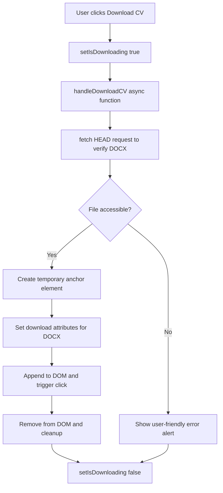
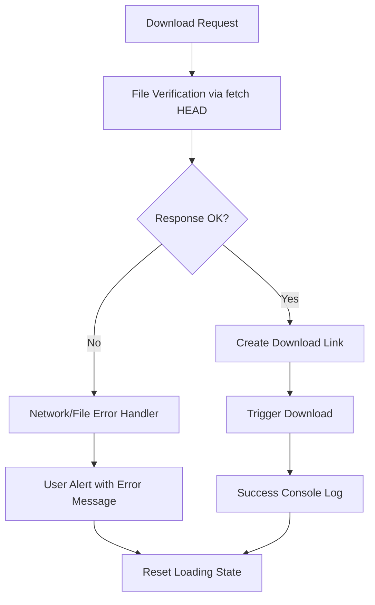
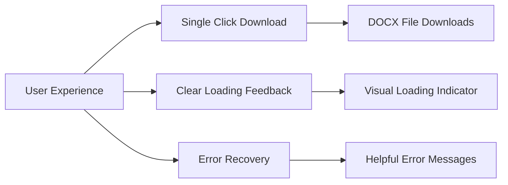

# Coming Soon CV Document Integration Design

## Overview

This design document outlines the implementation plan for updating the existing CV download functionality in the React-based portfolio website to use "Coming soon.docx" instead of the current PDF format. The feature will maintain the existing robust download mechanism, error handling, and user experience while transitioning to a Word document format that serves as a placeholder for future CV updates.

### Technology Context
- **Framework**: React 18 with functional components and hooks
- **Build Tool**: Vite for fast development and optimized production builds
- **Styling**: TailwindCSS for responsive design and animations
- **State Management**: React useState for local component state
- **Testing**: Vitest with React Testing Library

## Architecture

### Current Implementation Analysis

The existing CV download system is implemented in the `AboutSection` component with the following characteristics:

- **File Location**: `/public/assets/documents/Sadique_Hasan_CV.pdf`
- **Import Method**: Static import via Vite's asset handling
- **Download Mechanism**: Programmatic download with fallback error handling
- **User Feedback**: Loading states and error messages
- **File Verification**: HEAD request to verify file accessibility

### Updated Architecture



## Component Architecture

### File Structure Impact

```
portfolio-react/
├── public/
│   └── assets/
│       └── documents/
│           ├── Sadique_Hasan_CV.pdf        # To be replaced
│           └── Coming soon.docx             # New file
└── src/
    └── components/
        └── sections/
            └── AboutSection.jsx             # Updated import and filename
```

### Import Strategy

The component will use Vite's static asset import system to reference the new DOCX file. Vite automatically processes assets from the `public` directory and makes them available at runtime:

```javascript
import CV from '/assets/documents/Coming soon.docx'
```

**Vite Asset Handling**:
- Assets in `public/` directory are served at the root level
- No bundling or transformation applied to maintain original file format
- Automatic cache busting in production builds
- Direct file serving in development mode

## Data Models & File Handling

### File Properties

| Property | Current Value | Updated Value |
|----------|---------------|---------------|
| **File Name** | `Sadique_Hasan_CV.pdf` | `Coming soon.docx` |
| **MIME Type** | `application/pdf` | `application/vnd.openxmlformats-officedocument.wordprocessingml.document` |
| **Download Attribute** | `Sadique_Hasan_CV.pdf` | `Coming soon.docx` |
| **File Path** | `/assets/documents/Sadique_Hasan_CV.pdf` | `/assets/documents/Coming soon.docx` |

### Enhanced Error Handling

The existing error handling system will be maintained with DOCX-specific considerations:



## Business Logic Layer

### Download Handler Enhancement

The `handleDownloadCV` function will be updated with DOCX-specific considerations:

#### File Verification Logic
The current implementation uses a robust verification system that will be maintained:

```javascript
const response = await fetch(CV, { method: 'HEAD' })
if (!response.ok) {
  throw new Error(`File not accessible: ${response.status}`)
}
```

#### Download Process Flow
1. **Pre-download Validation**
   - Set `isDownloading` state to `true` for UI feedback
   - Perform HEAD request to verify DOCX file accessibility
   - Handle network connectivity issues

2. **Download Execution**
   - Create temporary anchor element with enhanced security attributes
   - Set DOCX-specific download filename
   - Append to DOM, trigger click, and immediately remove

3. **Post-download Cleanup**
   - Reset `isDownloading` state to `false`
   - Log success message to console
   - Display user-friendly error alerts for failures

### State Management

The component maintains download state through React hooks for optimal user experience:

```javascript
const [isDownloading, setIsDownloading] = useState(false)
```

**State Usage**:
- Controls button disabled state during download
- Triggers loading spinner animation
- Prevents multiple simultaneous download attempts
- Provides visual feedback through TailwindCSS animations

## API Integration Layer

### File Serving Strategy

The DOCX file will be served as a static asset through Vite's optimized serving mechanism:

- **Development**: Direct file serving from `public/assets/documents/` via Vite dev server
- **Production**: Automatic copying to `dist/assets/documents/` during build
- **Deployment**: Compatible with existing Netlify, Vercel, and GitHub Pages configurations
- **Caching**: Leverages existing deployment configurations for optimal performance

### Browser Compatibility

#### DOCX Download Support
- **Modern Browsers**: Full support for programmatic downloads
- **Legacy Browsers**: Fallback to new tab opening
- **Mobile Devices**: Native download manager integration

#### MIME Type Handling
- **Chrome/Edge**: Native DOCX recognition
- **Firefox**: Built-in Office document handling
- **Safari**: System-level document association

## Testing Strategy

### Unit Testing with Vitest and React Testing Library

1. **Component State Testing**
   ```javascript
   // Test loading state management
   test('should show loading state during download', async () => {
     render(<AboutSection />)
     const downloadButton = screen.getByRole('button', { name: /download cv/i })
     fireEvent.click(downloadButton)
     expect(screen.getByText(/downloading/i)).toBeInTheDocument()
   })
   ```

2. **Download Function Testing**
   - Mock `fetch` for file accessibility checks
   - Test error handling with different response codes
   - Verify DOM manipulation for download link creation
   - Test cleanup and state reset functionality

3. **User Interaction Testing**
   - Button click behavior and disabled states
   - Loading state transitions and visual feedback
   - Error message display and user notifications

### Integration Testing

1. **Vite Build Integration Tests**
   - Verify DOCX file is correctly copied to `dist/` directory
   - Test asset path resolution in production builds
   - Validate deployment configurations maintain file accessibility

2. **Cross-browser Testing**
   - Test programmatic download across Chrome, Firefox, Safari, Edge
   - Verify DOCX file association and opening behavior
   - Test mobile browser compatibility and download managers

### User Acceptance Criteria



## Implementation Details

### Code Changes Required

#### 1. File System Changes
```bash
# Remove existing PDF
rm portfolio-react/public/assets/documents/Sadique_Hasan_CV.pdf

# Add new DOCX file
# Place "Coming soon.docx" in portfolio-react/public/assets/documents/
```

#### 2. Component Import Update
```javascript
// AboutSection.jsx - Line 7
// Before
import CV from '/assets/documents/Sadique_Hasan_CV.pdf'

// After  
import CV from '/assets/documents/Coming soon.docx'
```

#### 3. Download Attributes Update
```javascript
// AboutSection.jsx - handleDownloadCV function
// Update download filename attribute
link.download = 'Coming soon.docx'
```

#### 4. Maintain Existing Error Handling
The current error handling is already robust and user-friendly:
```javascript
const errorMessage = error.message.includes('fetch') 
  ? 'Network error: Please check your connection and try again.'
  : 'Sorry, the CV file is temporarily unavailable. Please try again later.'
```

### Configuration Updates

#### Vite Configuration
No changes required to `vite.config.js` - Vite handles DOCX files as static assets by default.

#### Build Process
```bash
# Development
npm run dev  # File served from public/assets/documents/

# Production Build
npm run build  # DOCX copied to dist/assets/documents/
npm run preview  # Test production build locally
```

#### Deployment Compatibility
Existing deployment configurations remain valid:
- **Netlify**: `netlify.toml` configuration maintains asset serving
- **Vercel**: `vercel.json` routing handles static assets
- **GitHub Pages**: Build workflow copies assets correctly

## User Experience Enhancements

### Visual Feedback (TailwindCSS Animations)
- Maintain existing loading spinner with `animate-spin` class
- Preserve hover effects: `hover:scale-105 transition-transform duration-300`
- Keep accessibility features and ARIA attributes
- Maintain icon animations: `group-hover:animate-bounce`

### Download Behavior
- DOCX files will download and open in default Office application (Word, LibreOffice, etc.)
- Browser fallback for devices without Office applications
- Mobile compatibility with native download managers
- Maintains existing security attributes: `rel="noopener noreferrer"`

### Error Handling
- Preserve existing user-friendly alert messages
- Graceful degradation for network connectivity issues
- Console logging for debugging purposes
- Automatic state cleanup on errors or success

## Performance Considerations

### File Size and Loading Impact
- DOCX files are typically more compact than equivalent PDF documents
- Reduced bandwidth usage for downloads improves user experience
- Faster file transfer, especially beneficial for mobile users
- Vite's asset optimization ensures efficient serving

### Caching and Build Optimization
- **Browser Caching**: HTTP cache headers from deployment CDNs
- **Build Caching**: Vite's asset hashing for cache invalidation
- **CDN Distribution**: Leverages existing Netlify/Vercel edge locations
- **Asset Versioning**: Automatic hash-based naming in production builds

### Development Performance
- Hot module replacement (HMR) unaffected by asset changes
- Fast refresh maintains development speed
- Asset serving optimized by Vite dev server

## Security Considerations

### File Integrity and Validation
- DOCX file integrity verified during Vite build process
- File accessibility validated via HEAD request before download
- Secure HTTPS serving through deployment platforms
- Maintain existing Content Security Policy (CSP) compliance

### Download Security
- Preserve existing `rel="noopener noreferrer"` attributes on download links
- Prevent malicious file substitution through asset integrity
- Validate file existence and accessibility before user interaction
- Secure handling of temporary DOM elements during download process

### Deployment Security
- Static asset serving maintains existing security configurations
- No server-side processing reduces attack surface
- File served from trusted CDN endpoints (Netlify, Vercel, GitHub Pages)
