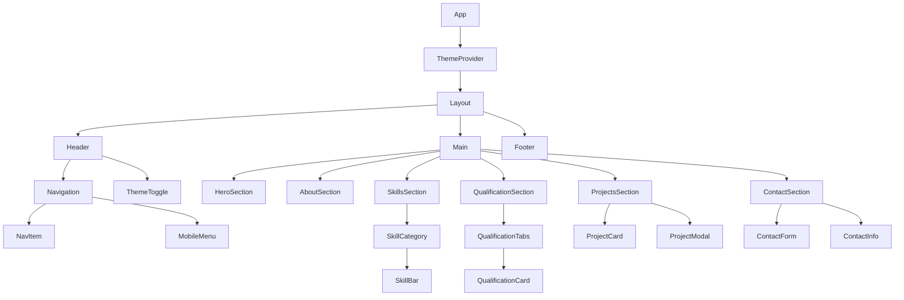
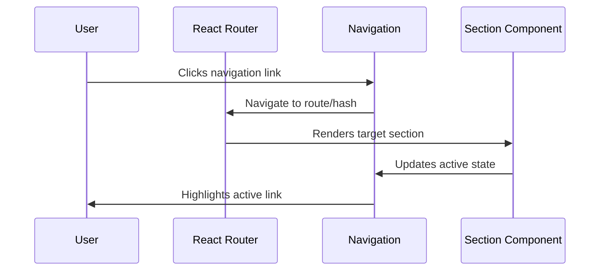
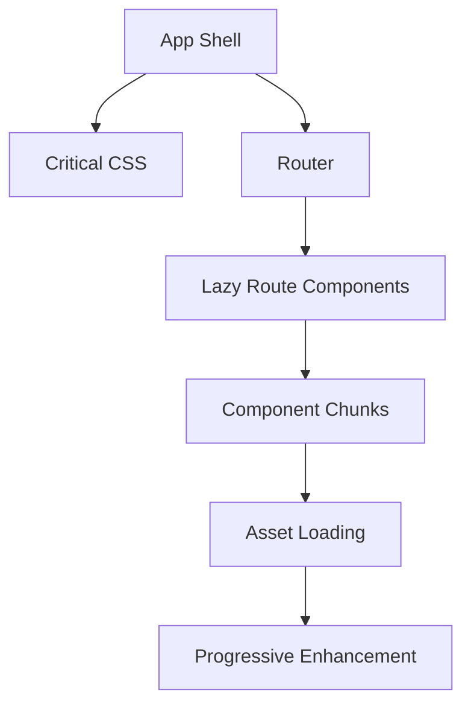

# React Migration Design Document
## Portfolio Website Modernization

## Overview
This document outlines the migration strategy for transforming the existing static HTML/CSS/JavaScript portfolio website into a modern React application with enhanced functionality, improved performance, and a unique contemporary design system.

**Current State Analysis:**
- Static website built with vanilla HTML5, CSS3, and JavaScript
- EmailJS integration for contact form functionality
- Dark/light theme toggle with localStorage persistence
- Mobile-responsive design with CSS Grid and Flexbox
- Single-page application with smooth scrolling navigation

**Target State:**
- Modern React application with JavaScript
- Component-based architecture with reusable UI components
- Enhanced animations and micro-interactions
- Advanced state management and routing
- Modern design system with glassmorphism and neumorphism elements

## Technology Stack & Dependencies

### Frontend Framework
- **React 18**: Latest version with concurrent features and Suspense
- **JavaScript ES6+**: Modern JavaScript with ES modules and async/await
- **Vite**: Fast build tool and development server
- **React Router**: Client-side routing for navigation

### Styling & Design
- **Tailwind CSS**: Utility-first CSS framework for rapid development
- **Framer Motion**: Advanced animations and gesture handling
- **React Spring**: Physics-based animations for micro-interactions
- **Styled Components**: CSS-in-JS for component-specific styling

### State Management & Data
- **Zustand**: Lightweight state management for theme and UI state
- **React Query**: Server state management and caching
- **React Hook Form**: Form validation and submission handling

### Development Tools
- **ESLint + Prettier**: Code quality and formatting
- **Husky**: Git hooks for pre-commit checks
- **Storybook**: Component development and documentation
- **PropTypes**: Runtime type checking for React props

## Component Architecture

### Component Hierarchy



### Core Components

#### Layout Components
- **Header**: Fixed navigation with smooth scroll and active section highlighting
- **Navigation**: Responsive navigation with mobile hamburger menu
- **ThemeToggle**: Enhanced theme switcher with smooth transitions
- **Footer**: Simplified footer with social links and copyright

#### Section Components
- **HeroSection**: Enhanced hero with particle animations and typing effects
- **AboutSection**: Interactive about section with skill highlights
- **SkillsSection**: Animated skill bars with progress indicators
- **QualificationSection**: Timeline layout with hover effects
- **ProjectsSection**: Grid layout with filtering and search capabilities
- **ContactSection**: Advanced contact form with real-time validation

#### UI Components
- **Button**: Reusable button component with variants and animations
- **Card**: Flexible card component for content display
- **Modal**: Accessible modal component for project details
- **ProgressBar**: Animated progress indicators for skills
- **Tabs**: Accessible tab component for qualifications
- **ParticleBackground**: Interactive particle system for hero section

### Props/State Management

#### Global State (Zustand)
```javascript
// AppState structure
const useAppStore = create((set) => ({
  theme: 'light', // 'light' | 'dark'
  activeSection: '',
  mobileMenuOpen: false,
  toggleTheme: () => set((state) => ({ 
    theme: state.theme === 'light' ? 'dark' : 'light' 
  })),
  setActiveSection: (section) => set({ activeSection: section }),
  toggleMobileMenu: () => set((state) => ({ 
    mobileMenuOpen: !state.mobileMenuOpen 
  }))
}))
```

#### Component Props Examples
```javascript
// SkillBar component with PropTypes
const SkillBar = ({ skill, percentage, delay = 0, animated = true }) => {
  // Component implementation
}

SkillBar.propTypes = {
  skill: PropTypes.string.isRequired,
  percentage: PropTypes.number.isRequired,
  delay: PropTypes.number,
  animated: PropTypes.bool
}

// ProjectCard component with PropTypes
const ProjectCard = ({ project, onClick }) => {
  // Component implementation
}

ProjectCard.propTypes = {
  project: PropTypes.shape({
    id: PropTypes.string.isRequired,
    title: PropTypes.string.isRequired,
    description: PropTypes.string.isRequired,
    technologies: PropTypes.arrayOf(PropTypes.string).isRequired,
    image: PropTypes.string.isRequired,
    liveUrl: PropTypes.string,
    githubUrl: PropTypes.string
  }).isRequired,
  onClick: PropTypes.func.isRequired
}
```

## Routing & Navigation

### Route Structure
- `/` - Home page (Hero + About + Skills)
- `/projects` - Dedicated projects showcase
- `/contact` - Enhanced contact page
- `/resume` - Interactive resume/CV page

### Navigation Implementation


## Styling Strategy

### Design System Evolution

#### Color Palette
- **Primary**: Deep purple gradient (#6366f1 to #8b5cf6)
- **Secondary**: Emerald gradient (#10b981 to #059669)
- **Accent**: Golden amber (#f59e0b)
- **Neutral**: Modern grays with blue undertones
- **Background**: Dynamic gradients with dark/light variants

#### Typography Scale
- **Display**: Inter/Poppins for headings (48px-72px)
- **Heading**: Inter for section titles (24px-36px)
- **Body**: Inter for content (14px-18px)
- **Caption**: Inter for meta text (12px-14px)

#### Modern Design Elements
- **Glassmorphism**: Translucent cards with backdrop blur
- **Neumorphism**: Subtle shadow-based depth for interactive elements
- **Gradient Overlays**: Dynamic background gradients
- **Micro-animations**: Hover states and loading animations
- **Smooth Transitions**: 300ms ease-in-out for all interactions

### Component Styling Approach
```javascript
// Tailwind utility classes for rapid prototyping
const heroClasses = "min-h-screen bg-gradient-to-br from-primary-500 to-secondary-600"

// Styled components for complex styling
const GlassCard = styled.div`
  background: rgba(255, 255, 255, 0.1);
  backdrop-filter: blur(10px);
  border: 1px solid rgba(255, 255, 255, 0.2);
  border-radius: 16px;
  box-shadow: 0 8px 32px rgba(0, 0, 0, 0.1);
`
```

## State Management

### Theme Management
```javascript
const useThemeStore = create((set) => ({
  theme: localStorage.getItem('theme') || 'light',
  toggleTheme: () => set((state) => {
    const newTheme = state.theme === 'light' ? 'dark' : 'light'
    localStorage.setItem('theme', newTheme)
    return { theme: newTheme }
  })
}))
```

### Form State with React Hook Form
```javascript
const ContactForm = () => {
  const { register, handleSubmit, formState: { errors } } = useForm()
  
  const mutation = useMutation({
    mutationFn: sendContactEmail,
    onSuccess: () => toast.success('Message sent successfully!'),
    onError: () => toast.error('Failed to send message')
  })
}
```

## API Integration Layer

### Contact Form Enhancement
- **EmailJS**: Maintain existing email service integration
- **Form Validation**: Real-time validation with error messages
- **Rate Limiting**: Prevent spam submissions
- **Success Feedback**: Toast notifications and form state management

### Data Layer
```javascript
// Services for external integrations
export const emailService = {
  sendMessage: async (data) => {
    return emailjs.send(serviceId, templateId, data)
  }
}

// Custom hooks for data fetching
export const useContactForm = () => {
  return useMutation({
    mutationFn: emailService.sendMessage,
    onSuccess: () => {
      // Handle success
    }
  })
}
```

## Migration Strategy

### Phase 1: Foundation Setup
1. **Project Initialization**
   - Create React + JavaScript + Vite project
   - Configure Tailwind CSS and development tools
   - Set up component library structure with PropTypes

2. **Core Infrastructure**
   - Implement routing with React Router
   - Set up state management with Zustand
   - Configure build and deployment pipeline

### Phase 2: Component Migration
1. **Layout Components**
   - Convert header and navigation to React components
   - Implement responsive mobile menu
   - Create theme toggle functionality

2. **Section Components**
   - Migrate hero section with enhanced animations
   - Convert about section with interactive elements
   - Transform skills section with animated progress bars

### Phase 3: Enhanced Features
1. **Advanced Interactions**
   - Add particle animations to hero section
   - Implement smooth scroll with section highlighting
   - Create project filtering and search functionality

2. **Modern Design Elements**
   - Apply glassmorphism effects to cards
   - Add micro-animations and hover effects
   - Implement dynamic gradient backgrounds

### Phase 4: Optimization & Testing
1. **Performance Optimization**
   - Implement code splitting and lazy loading
   - Optimize images and assets
   - Add loading states and skeleton screens

2. **Testing & Quality Assurance**
   - Unit tests for components and utilities
   - Integration tests for user flows
   - Accessibility testing and improvements

## Testing Strategy

### Unit Testing
- **Vitest**: Fast unit testing for components and utilities
- **React Testing Library**: Component behavior testing
- **Coverage Target**: 80% for critical components

### Component Testing
```javascript
describe('SkillBar Component', () => {
  it('should animate to correct percentage', async () => {
    render(<SkillBar skill="React" percentage={80} />)
    
    await waitFor(() => {
      expect(screen.getByRole('progressbar')).toHaveAttribute('aria-valuenow', '80')
    })
  })
})
```

### Integration Testing
- **Cypress**: End-to-end testing for critical user journeys
- **Storybook**: Visual regression testing for UI components
- **Accessibility Testing**: Automated a11y testing with axe-core

## Performance Considerations

### Optimization Techniques
- **Code Splitting**: Route-based and component-based splitting
- **Lazy Loading**: Defer loading of non-critical components
- **Image Optimization**: WebP format with fallbacks
- **Bundle Analysis**: Regular bundle size monitoring

### Loading Strategy


### Performance Metrics Target
- **First Contentful Paint**: < 1.5s
- **Largest Contentful Paint**: < 2.5s
- **Time to Interactive**: < 3.5s
- **Cumulative Layout Shift**: < 0.1

## Enhanced Features

### New Functionality
1. **Project Showcase Enhancement**
   - Interactive project gallery with filtering
   - Live demo integration and GitHub links
   - Technology stack badges and descriptions

2. **Advanced Contact Features**
   - Real-time form validation with error handling
   - Calendar integration for scheduling meetings
   - Social media link previews

3. **Interactive Elements**
   - Particle animation system for hero background
   - Scroll-triggered animations throughout sections
   - Dynamic cursor effects on desktop

4. **Content Management**
   - Easy content updates through JSON configuration
   - Dynamic skill and project data loading
   - Internationalization support for future expansion

### Accessibility Improvements
- **Keyboard Navigation**: Full keyboard accessibility
- **Screen Reader Support**: Proper ARIA labels and descriptions
- **Color Contrast**: WCAG 2.1 AA compliance
- **Motion Preferences**: Respect user's reduced motion settings

## Migration Timeline

### Week 1-2: Foundation
- Project setup and configuration
- Core infrastructure implementation
- Basic component structure

### Week 3-4: Component Migration
- Convert existing sections to React components
- Implement responsive design system
- Add basic animations and interactions

### Week 5-6: Enhancement
- Advanced features and modern design elements
- Performance optimization
- Testing implementation

### Week 7-8: Polish & Deploy
- Final testing and bug fixes
- Documentation and deployment
- Performance monitoring setup