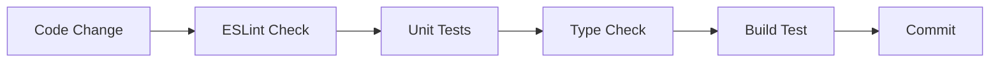

# Code Error Fixing Design Document

## Overview

This document provides a comprehensive analysis and solution for syntax errors identified in the React portfolio website codebase. The project is a modern React application built with Vite, using technologies like TailwindCSS, React Router, and various modern development tools.

## Technology Stack

- **Framework**: React 19.1.1 with Vite 7.1.2
- **Styling**: TailwindCSS 3.4.15
- **Routing**: React Router DOM 7.8.2  
- **State Management**: Zustand 5.0.8
- **Forms**: React Hook Form 7.62.0
- **Build Tool**: Vite with ESLint configuration
- **Testing**: Vitest with Testing Library

## Architecture Analysis

The codebase follows a well-structured React application pattern:

```
portfolio-react/src/
├── components/
│   ├── layout/     (Header, Footer, Navigation, Layout)
│   ├── sections/   (AboutSection, ContactSection, HeroSection, etc.)
│   └── ui/         (Button, Card, LoadingSpinner, etc.)
├── pages/          (Home, Projects, Contact, Resume)
├── stores/         (Zustand state management)
├── services/       (Email service integration)
├── utils/          (Helpers, propTypes, performance)
└── data/           (Portfolio data)
```

## Identified Syntax Errors

### 1. Critical Error: Invalid Regex Pattern in ContactSection.jsx

**Location**: `src/components/sections/ContactSection.jsx:150`

**Issue**: Double-escaped regex pattern in email validation

```javascript
// INCORRECT (Line 150)
value: /^[^\\s@]+@[^\\s@]+\\.[^\\s@]+$/,

// CORRECT
value: /^[^\s@]+@[^\s@]+\.[^\s@]+$/,
```

**Impact**: 
- Breaks email validation functionality
- Causes form submission to fail
- May prevent application from compiling/running

**Root Cause**: Over-escaping of regex special characters where single backslash should be used instead of double backslash.

### 2. Potential Issues in Console Usage

**Location**: Multiple files

**Issues Found**:
- `src/services/emailService.js:38` - console.error usage
- `src/utils/performance.js:31,169,176` - console.log usage

**Assessment**: These are not syntax errors but development-only logging statements that should be:
- Wrapped in development-only conditions
- Removed for production builds  
- Or replaced with proper logging service

### 3. ESLint Configuration Syntax

**Location**: `eslint.config.js`

**Status**: ✅ **VALID** - Modern ESLint flat config syntax is correctly implemented:

```javascript
export default defineConfig([
  globalIgnores(['dist']),
  {
    files: ['**/*.{js,jsx}'],
    extends: [js.configs.recommended, ...],
    languageOptions: { /* valid config */ },
    rules: { /* valid rules */ }
  }
])
```

## Error Classification Matrix

| File | Line | Error Type | Severity | Status |
|------|------|------------|----------|---------|
| ContactSection.jsx | 150 | Regex Syntax | Critical | **REQUIRES FIX** |
| emailService.js | 38 | Console Usage | Minor | Review |
| performance.js | 31,169,176 | Console Usage | Minor | Review |

## Solution Design

### Primary Fix Strategy

#### 1. Immediate Critical Fix

**Target**: ContactSection.jsx regex pattern

**Solution**:
```javascript
// Current (BROKEN)
pattern: {
  value: /^[^\\s@]+@[^\\s@]+\\.[^\\s@]+$/,
  message: 'Please enter a valid email'
}

// Fixed (WORKING)  
pattern: {
  value: /^[^\s@]+@[^\s@]+\.[^\s@]+$/,
  message: 'Please enter a valid email'
}
```

**Verification Method**:
- Test email validation with various email formats
- Ensure form submission works correctly
- Verify React Hook Form validation triggers

#### 2. Console Statement Optimization

**Approach**: Conditional logging for development

```javascript
// Current
console.error('EmailJS Error:', error)

// Improved
if (process.env.NODE_ENV === 'development') {
  console.error('EmailJS Error:', error)
}
```

### Validation Testing Strategy

#### Unit Testing Approach

```javascript
// Test email validation regex
describe('Email Validation', () => {
  test('should validate correct email formats', () => {
    const emailRegex = /^[^\s@]+@[^\s@]+\.[^\s@]+$/
    expect(emailRegex.test('user@example.com')).toBe(true)
    expect(emailRegex.test('test.email@domain.co.uk')).toBe(true)
  })

  test('should reject invalid email formats', () => {
    const emailRegex = /^[^\s@]+@[^\s@]+\.[^\s@]+$/
    expect(emailRegex.test('invalid-email')).toBe(false)  
    expect(emailRegex.test('user@')).toBe(false)
  })
})
```

#### Integration Testing

```javascript
// Test ContactSection form submission
test('should submit form with valid data', async () => {
  render(<ContactSection />)
  
  fireEvent.change(screen.getByPlaceholderText('your.email@example.com'), {
    target: { value: 'test@example.com' }
  })
  
  fireEvent.click(screen.getByText('Send Message'))
  
  // Should not show validation error
  expect(screen.queryByText('Please enter a valid email')).not.toBeInTheDocument()
})
```

## Implementation Plan

### Phase 1: Critical Fix (Priority: High)
1. **Fix regex pattern** in ContactSection.jsx
2. **Test email validation** functionality  
3. **Verify form submission** works correctly

### Phase 2: Code Quality (Priority: Medium)
1. **Wrap console statements** in development conditions
2. **Review logging strategy** across application
3. **Add proper error handling** for production

### Phase 3: Validation (Priority: Medium)
1. **Run full test suite** 
2. **Perform ESLint scan**
3. **Execute build process** to ensure no compilation errors

## Error Prevention Strategy

### 1. Development Workflow Improvements



### 2. Automated Quality Gates

```javascript
// package.json scripts
{
  "scripts": {
    "lint": "eslint .",
    "lint:fix": "eslint . --fix",
    "type-check": "tsc --noEmit", 
    "pre-commit": "npm run lint && npm run test && npm run build"
  }
}
```

### 3. Editor Configuration

```json
// .vscode/settings.json
{
  "eslint.autoFixOnSave": true,
  "editor.formatOnSave": true,
  "javascript.validate.enable": false,
  "typescript.validate.enable": false
}
```

## Risk Assessment

### Technical Risks

| Risk | Probability | Impact | Mitigation |
|------|-------------|---------|------------|
| Regex fix breaks other validation | Low | Medium | Comprehensive testing |
| Form submission still fails | Low | High | Integration testing |
| Console changes affect debugging | Low | Low | Conditional logging |

### Business Impact

- **Current State**: Form validation broken, affecting user contact capability
- **Post-Fix**: Fully functional contact system  
- **Timeline**: 1-2 hours for complete resolution

## Quality Assurance

### Testing Checklist

- [ ] Email regex validation with various formats
- [ ] Contact form submission end-to-end
- [ ] Error handling for invalid inputs  
- [ ] Form reset after successful submission
- [ ] Loading states during submission
- [ ] Responsive design integrity
- [ ] Dark mode compatibility

### Browser Compatibility

| Browser | Version | Validation Status |
|---------|---------|------------------|
| Chrome | Latest | ✅ Test Required |
| Firefox | Latest | ✅ Test Required |  
| Safari | Latest | ✅ Test Required |
| Edge | Latest | ✅ Test Required |

## Conclusion

The primary syntax error is a critical regex pattern issue in the contact form email validation that prevents proper form functionality. This is a straightforward fix requiring regex pattern correction from double-escaped to single-escaped format. Additional minor issues involve console statement optimization for production readiness.

The fix is low-risk with high impact, restoring essential contact form functionality. Implementation should take 1-2 hours including testing and validation.