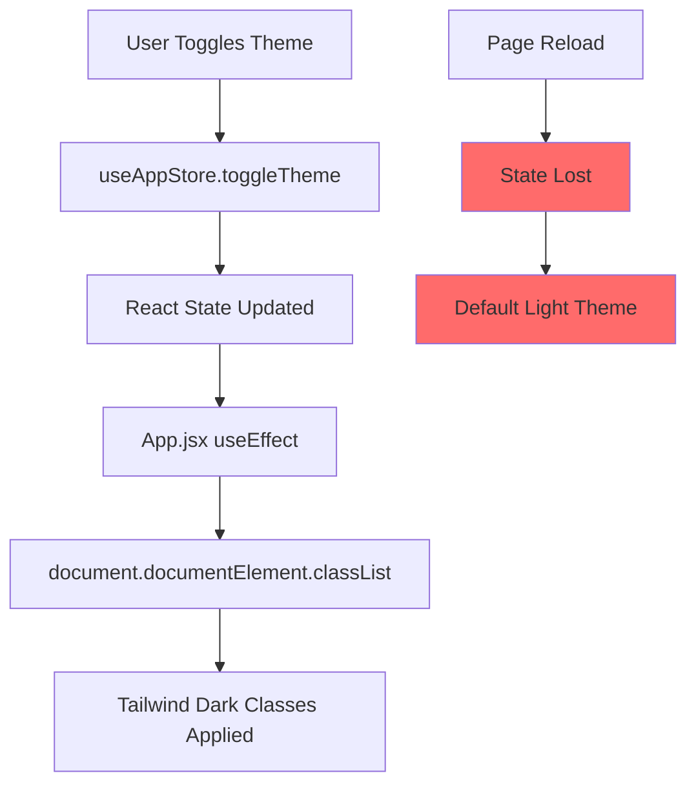
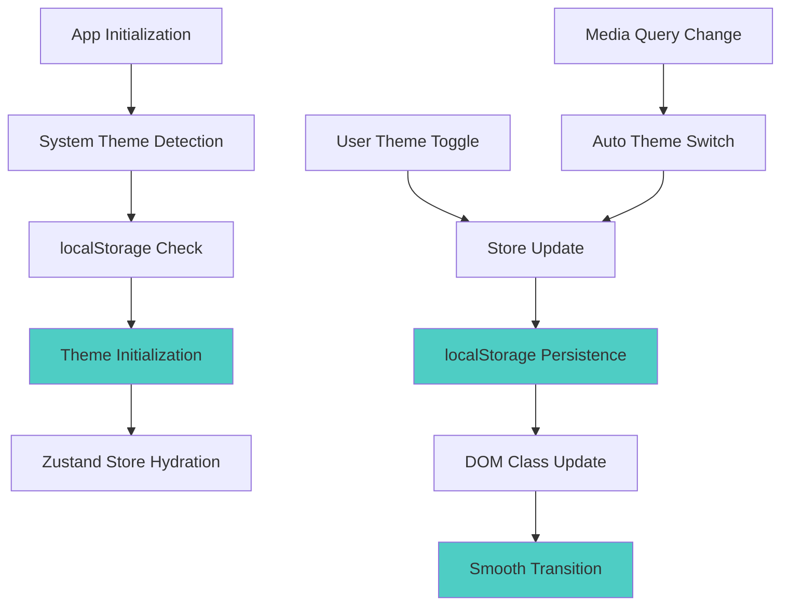

# Dark Mode Enhancement Design

## Overview

This design addresses critical issues with the portfolio website's dark mode implementation to create a smooth, eye-friendly, and persistent dark theme experience. The current implementation lacks localStorage persistence, proper system theme detection, and optimal color schemes for extended viewing comfort.

## Architecture

### Current State Analysis

The portfolio website has two implementations:
- **Legacy vanilla JS** implementation with localStorage persistence
- **React implementation** using Zustand store without persistence
- **Incomplete Tailwind configuration** missing dark mode strategy
- **Inconsistent theme application** across components



### Enhanced Architecture



## Enhanced Theme System

### Store Enhancement with Persistence

```javascript
// Enhanced useAppStore with persistence middleware
import { create } from 'zustand'
import { persist, createJSONStorage } from 'zustand/middleware'

const useAppStore = create(
  persist(
    (set, get) => ({
      // Theme state with system detection
      theme: 'system', // 'light' | 'dark' | 'system'
      resolvedTheme: 'light', // actual computed theme
      
      // Initialize theme from system preference
      initializeTheme: () => {
        const savedTheme = localStorage.getItem('portfolio-theme')
        const systemPrefersDark = window.matchMedia('(prefers-color-scheme: dark)').matches
        
        if (savedTheme && ['light', 'dark', 'system'].includes(savedTheme)) {
          set({ theme: savedTheme })
        }
        
        const resolvedTheme = savedTheme === 'system' 
          ? (systemPrefersDark ? 'dark' : 'light')
          : savedTheme || (systemPrefersDark ? 'dark' : 'light')
          
        set({ resolvedTheme })
      },
      
      // Enhanced toggle with cycling through options
      toggleTheme: () => set((state) => {
        const themeOrder = ['light', 'dark', 'system']
        const currentIndex = themeOrder.indexOf(state.theme)
        const nextTheme = themeOrder[(currentIndex + 1) % themeOrder.length]
        
        return { theme: nextTheme }
      }),
      
      // Set specific theme
      setTheme: (theme) => set({ theme }),
      
      // Update resolved theme when system preference changes
      updateResolvedTheme: (resolvedTheme) => set({ resolvedTheme }),
    }),
    {
      name: 'portfolio-theme-storage',
      storage: createJSONStorage(() => localStorage),
      partialize: (state) => ({ 
        theme: state.theme 
      }),
    }
  )
)
```

### Enhanced Tailwind Configuration

```javascript
// tailwind.config.js - Enhanced dark mode configuration
export default {
  content: ["./index.html", "./src/**/*.{js,ts,jsx,tsx}"],
  darkMode: 'class', // Enable class-based dark mode
  theme: {
    extend: {
      colors: {
        // Enhanced color palette for better contrast
        light: {
          primary: '#f8fafc',
          secondary: '#f1f5f9',
          accent: '#e2e8f0',
          text: {
            primary: '#1e293b',
            secondary: '#475569',
            tertiary: '#64748b',
          },
          border: '#e2e8f0',
        },
        dark: {
          primary: '#0f172a',    // Deep navy for main background
          secondary: '#1e293b',  // Slightly lighter for cards
          accent: '#334155',     // For interactive elements
          text: {
            primary: '#f8fafc',  // High contrast white
            secondary: '#cbd5e1', // Reduced contrast for secondary text
            tertiary: '#94a3b8',  // Even softer for tertiary text
          },
          border: '#334155',
        },
        // Eye-friendly color adjustments
        primary: {
          50: '#eff6ff',
          100: '#dbeafe',
          200: '#bfdbfe',
          300: '#93c5fd',
          400: '#60a5fa',
          500: '#3b82f6',   // Slightly softer blue
          600: '#2563eb',
          700: '#1d4ed8',
          800: '#1e40af',
          900: '#1e3a8a',
          950: '#172554',
        },
      },
      // Enhanced transitions for smooth theme switching
      transitionProperty: {
        'theme': 'background-color, border-color, color, fill, stroke, opacity, box-shadow, transform',
      },
      transitionDuration: {
        'theme': '300ms',
      },
      // Custom animations for theme transitions
      animation: {
        'theme-transition': 'themeTransition 0.3s ease-in-out',
      },
      keyframes: {
        themeTransition: {
          '0%': { opacity: '0.95' },
          '50%': { opacity: '0.98' },
          '100%': { opacity: '1' },
        },
      },
    },
  },
  plugins: [
    require('@tailwindcss/typography'),
    require('@tailwindcss/forms'),
  ],
}
```

### System Theme Detection Hook

```javascript
// hooks/useSystemTheme.js
import { useEffect } from 'react'
import useAppStore from '../stores/useAppStore'

export const useSystemTheme = () => {
  const { theme, updateResolvedTheme } = useAppStore()
  
  useEffect(() => {
    const mediaQuery = window.matchMedia('(prefers-color-scheme: dark)')
    
    const handleSystemThemeChange = (e) => {
      if (theme === 'system') {
        updateResolvedTheme(e.matches ? 'dark' : 'light')
      }
    }
    
    // Set initial resolved theme
    if (theme === 'system') {
      updateResolvedTheme(mediaQuery.matches ? 'dark' : 'light')
    } else {
      updateResolvedTheme(theme)
    }
    
    mediaQuery.addEventListener('change', handleSystemThemeChange)
    
    return () => {
      mediaQuery.removeEventListener('change', handleSystemThemeChange)
    }
  }, [theme, updateResolvedTheme])
}
```

## Component Enhancements

### Enhanced ThemeToggle Component

```jsx
// components/ui/ThemeToggle.jsx
import { useState, useEffect } from 'react'
import useAppStore from '../../stores/useAppStore'

function ThemeToggle() {
  const { theme, toggleTheme, resolvedTheme } = useAppStore()
  const [isTransitioning, setIsTransitioning] = useState(false)
  
  const handleToggle = async () => {
    setIsTransitioning(true)
    
    // Smooth transition effect
    document.documentElement.style.transition = 'all 0.3s ease-in-out'
    
    toggleTheme()
    
    // Reset transition after completion
    setTimeout(() => {
      setIsTransitioning(false)
      document.documentElement.style.transition = ''
    }, 300)
  }
  
  const getIconAndLabel = () => {
    switch (theme) {
      case 'light':
        return { icon: 'uil-moon', label: 'Switch to dark theme' }
      case 'dark':
        return { icon: 'uil-sun', label: 'Switch to system theme' }
      case 'system':
        return { 
          icon: resolvedTheme === 'dark' ? 'uil-laptop' : 'uil-laptop', 
          label: 'Switch to light theme' 
        }
      default:
        return { icon: 'uil-moon', label: 'Switch to dark theme' }
    }
  }
  
  const { icon, label } = getIconAndLabel()
  
  return (
    <button
      onClick={handleToggle}
      disabled={isTransitioning}
      className={`
        relative p-3 rounded-xl
        bg-light-secondary dark:bg-dark-secondary
        text-light-text-primary dark:text-dark-text-primary
        border border-light-border dark:border-dark-border
        hover:bg-light-accent dark:hover:bg-dark-accent
        focus:outline-none focus:ring-2 focus:ring-primary-500 focus:ring-offset-2
        dark:focus:ring-offset-dark-primary
        transition-all duration-300 hover:scale-105
        ${isTransitioning ? 'animate-pulse' : ''}
      `}
      aria-label={label}
    >
      <i className={`${icon} text-xl transition-transform duration-300 ${
        isTransitioning ? 'rotate-180' : ''
      }`}></i>
      
      {/* Theme indicator */}
      <span className="absolute -top-1 -right-1 w-3 h-3 rounded-full bg-primary-500 opacity-75"></span>
    </button>
  )
}

export default ThemeToggle
```

### Enhanced App Component with Theme Management

```jsx
// App.jsx
import { BrowserRouter as Router } from 'react-router-dom'
import { useEffect, Suspense } from 'react'
import useAppStore from './stores/useAppStore'
import { useSystemTheme } from './hooks/useSystemTheme'
import { useScrollAnimations } from './hooks/useAnimations'
import { initPerformanceOptimizations } from './utils/performance'
import Layout from './components/layout/Layout'
import AppRoutes from './components/layout/AppRoutes'
import LoadingSpinner from './components/ui/LoadingSpinner'

function App() {
  const { initializeTheme, resolvedTheme } = useAppStore()
  
  // Initialize theme and system detection
  useSystemTheme()
  useScrollAnimations()

  useEffect(() => {
    // Initialize theme on app startup
    initializeTheme()
    
    // Initialize performance optimizations
    initPerformanceOptimizations()
  }, [initializeTheme])

  // Apply theme to document element with smooth transition
  useEffect(() => {
    const root = document.documentElement
    
    // Remove any existing theme classes
    root.classList.remove('light', 'dark')
    
    // Add the resolved theme class
    root.classList.add(resolvedTheme)
    
    // Update meta theme-color for browser chrome
    const metaThemeColor = document.querySelector('meta[name="theme-color"]')
    if (metaThemeColor) {
      metaThemeColor.setAttribute(
        'content', 
        resolvedTheme === 'dark' ? '#0f172a' : '#ffffff'
      )
    }
    
    // Prevent flash of wrong theme
    root.style.colorScheme = resolvedTheme
    
  }, [resolvedTheme])

  return (
    <Router>
      <div className={`
        min-h-screen 
        bg-light-primary dark:bg-dark-primary
        text-light-text-primary dark:text-dark-text-primary
        transition-theme duration-theme
        ${resolvedTheme === 'dark' ? 'dark' : ''}
      `}>
        <Suspense fallback={<LoadingSpinner />}>
          <Layout>
            <AppRoutes />
          </Layout>
        </Suspense>
      </div>
    </Router>
  )
}

export default App
```

## Enhanced Color Scheme for Eye Comfort

### CSS Custom Properties for Smooth Gradients

```css
/* index.css - Enhanced with custom properties */
@layer base {
  :root {
    /* Light theme - optimized for comfort */
    --color-bg-primary: 248 250 252; /* slate-50 */
    --color-bg-secondary: 241 245 249; /* slate-100 */
    --color-bg-accent: 226 232 240; /* slate-200 */
    
    --color-text-primary: 30 41 59; /* slate-800 */
    --color-text-secondary: 71 85 105; /* slate-600 */
    --color-text-tertiary: 100 116 139; /* slate-500 */
    
    --color-border: 226 232 240; /* slate-200 */
    --color-border-hover: 203 213 225; /* slate-300 */
    
    /* Shadows for depth */
    --shadow-sm: 0 1px 2px 0 rgb(0 0 0 / 0.05);
    --shadow-md: 0 4px 6px -1px rgb(0 0 0 / 0.1), 0 2px 4px -2px rgb(0 0 0 / 0.1);
    --shadow-lg: 0 10px 15px -3px rgb(0 0 0 / 0.1), 0 4px 6px -4px rgb(0 0 0 / 0.1);
  }

  .dark {
    /* Dark theme - optimized for reduced eye strain */
    --color-bg-primary: 15 23 42; /* slate-900 */
    --color-bg-secondary: 30 41 59; /* slate-800 */
    --color-bg-accent: 51 65 85; /* slate-700 */
    
    --color-text-primary: 248 250 252; /* slate-50 */
    --color-text-secondary: 203 213 225; /* slate-300 */
    --color-text-tertiary: 148 163 184; /* slate-400 */
    
    --color-border: 51 65 85; /* slate-700 */
    --color-border-hover: 71 85 105; /* slate-600 */
    
    /* Enhanced shadows for dark mode */
    --shadow-sm: 0 1px 2px 0 rgb(0 0 0 / 0.3);
    --shadow-md: 0 4px 6px -1px rgb(0 0 0 / 0.3), 0 2px 4px -2px rgb(0 0 0 / 0.2);
    --shadow-lg: 0 10px 15px -3px rgb(0 0 0 / 0.4), 0 4px 6px -4px rgb(0 0 0 / 0.2);
  }

  body {
    @apply font-sans antialiased;
    background-color: rgb(var(--color-bg-primary));
    color: rgb(var(--color-text-primary));
    transition: background-color 0.3s ease, color 0.3s ease;
  }

  /* Smooth theme transitions for all elements */
  *,
  *::before,
  *::after {
    transition-property: background-color, border-color, color, fill, stroke, opacity, box-shadow, transform;
    transition-duration: 0.3s;
    transition-timing-function: ease-in-out;
  }
}

@layer components {
  /* Enhanced component styles with CSS variables */
  .card-base {
    background-color: rgb(var(--color-bg-secondary));
    border: 1px solid rgb(var(--color-border));
    border-radius: 0.75rem;
    box-shadow: var(--shadow-sm);
    transition: all 0.3s ease;
  }
  
  .card-base:hover {
    border-color: rgb(var(--color-border-hover));
    box-shadow: var(--shadow-md);
    transform: translateY(-2px);
  }
  
  .btn-primary {
    @apply inline-flex items-center px-6 py-3 font-medium rounded-lg;
    background-color: rgb(59 130 246); /* blue-500 */
    color: white;
    box-shadow: var(--shadow-sm);
    transition: all 0.3s ease;
  }
  
  .btn-primary:hover {
    background-color: rgb(37 99 235); /* blue-600 */
    box-shadow: var(--shadow-md);
    transform: translateY(-1px);
  }
  
  /* Glass morphism effect for dark mode */
  .glass-effect {
    background: rgba(255, 255, 255, 0.05);
    backdrop-filter: blur(10px);
    border: 1px solid rgba(255, 255, 255, 0.1);
  }
  
  .dark .glass-effect {
    background: rgba(255, 255, 255, 0.05);
    backdrop-filter: blur(15px);
    border: 1px solid rgba(255, 255, 255, 0.1);
  }
}
```

## Component-Specific Enhancements

### Card Component with Enhanced Dark Mode

```jsx
// components/ui/Card.jsx
import PropTypes from 'prop-types'

function Card({ children, className = '', glassMorphism = false, ...props }) {
  const baseClasses = glassMorphism 
    ? 'glass-effect' 
    : 'card-base'
  
  return (
    <div 
      className={`${baseClasses} p-6 ${className}`}
      {...props}
    >
      {children}
    </div>
  )
}

Card.propTypes = {
  children: PropTypes.node.isRequired,
  className: PropTypes.string,
  glassMorphism: PropTypes.bool,
}

export default Card
```

### Enhanced Section Components

```jsx
// Example: Enhanced HeroSection with better dark mode support
function HeroSection() {
  return (
    <section className="
      min-h-screen flex items-center justify-center
      bg-gradient-to-br from-light-primary via-light-secondary to-light-accent
      dark:from-dark-primary dark:via-dark-secondary dark:to-dark-accent
      relative overflow-hidden
    ">
      {/* Enhanced gradient overlay for better contrast */}
      <div className="absolute inset-0 bg-gradient-to-t from-black/5 to-transparent dark:from-black/20"></div>
      
      <div className="container-custom relative z-10">
        {/* Content with enhanced typography contrast */}
        <h1 className="
          text-4xl md:text-6xl font-bold mb-6
          text-light-text-primary dark:text-dark-text-primary
          drop-shadow-sm dark:drop-shadow-lg
        ">
          Your Portfolio
        </h1>
        
        <p className="
          text-xl mb-8
          text-light-text-secondary dark:text-dark-text-secondary
        ">
          Enhanced for comfortable viewing
        </p>
      </div>
    </section>
  )
}
```

## Accessibility & Performance Enhancements

### Reduced Motion Support

```css
/* Respect user's motion preferences */
@media (prefers-reduced-motion: reduce) {
  *,
  *::before,
  *::after {
    animation-duration: 0.01ms !important;
    animation-iteration-count: 1 !important;
    transition-duration: 0.01ms !important;
    scroll-behavior: auto !important;
  }
}
```

### Focus Management in Dark Mode

```css
/* Enhanced focus indicators for accessibility */
.focus-ring {
  @apply focus:outline-none focus:ring-2 focus:ring-offset-2;
  @apply focus:ring-primary-500 dark:focus:ring-primary-400;
  @apply focus:ring-offset-light-primary dark:focus:ring-offset-dark-primary;
}

/* High contrast mode support */
@media (prefers-contrast: high) {
  .dark {
    --color-text-primary: 255 255 255;
    --color-bg-primary: 0 0 0;
    --color-border: 128 128 128;
  }
}
```

## Testing Strategy

### Theme Persistence Testing

```javascript
// tests/theme.test.js
import { renderHook, act } from '@testing-library/react'
import useAppStore from '../stores/useAppStore'

describe('Theme Persistence', () => {
  beforeEach(() => {
    localStorage.clear()
    window.matchMedia = jest.fn(() => ({
      matches: false,
      addEventListener: jest.fn(),
      removeEventListener: jest.fn(),
    }))
  })

  it('should persist theme preference to localStorage', () => {
    const { result } = renderHook(() => useAppStore())
    
    act(() => {
      result.current.setTheme('dark')
    })
    
    expect(localStorage.getItem('portfolio-theme-storage')).toContain('"theme":"dark"')
  })

  it('should detect system theme preference', () => {
    window.matchMedia.mockReturnValue({
      matches: true,
      addEventListener: jest.fn(),
      removeEventListener: jest.fn(),
    })
    
    const { result } = renderHook(() => useAppStore())
    
    act(() => {
      result.current.initializeTheme()
    })
    
    expect(result.current.resolvedTheme).toBe('dark')
  })
})
```

### Visual Regression Testing

```javascript
// tests/darkMode.visual.test.js
import { test, expect } from '@playwright/test'

test('dark mode visual consistency', async ({ page }) => {
  await page.goto('/')
  
  // Test light mode
  await expect(page).toHaveScreenshot('light-mode.png')
  
  // Toggle to dark mode
  await page.click('[aria-label*="Switch to dark"]')
  await page.waitForTimeout(400) // Wait for transition
  
  // Test dark mode
  await expect(page).toHaveScreenshot('dark-mode.png')
  
  // Test system preference
  await page.click('[aria-label*="Switch to system"]')
  await expect(page).toHaveScreenshot('system-mode.png')
})
```

## Performance Optimization

### Theme Transition Optimization

```javascript
// utils/themeOptimization.js
export const optimizeThemeTransition = () => {
  // Disable transitions during rapid theme changes
  let isTransitioning = false
  
  return {
    startTransition: () => {
      if (isTransitioning) return
      
      isTransitioning = true
      document.documentElement.style.setProperty('--transition-duration', '0ms')
    },
    
    endTransition: () => {
      setTimeout(() => {
        document.documentElement.style.setProperty('--transition-duration', '300ms')
        isTransitioning = false
      }, 100)
    }
  }
}
```

### Memory Management

```javascript
// hooks/useThemeCleanup.js
import { useEffect } from 'react'

export const useThemeCleanup = () => {
  useEffect(() => {
    return () => {
      // Cleanup theme-related event listeners
      const mediaQuery = window.matchMedia('(prefers-color-scheme: dark)')
      mediaQuery.removeEventListener('change', () => {})
      
      // Reset any inline styles
      document.documentElement.style.removeProperty('transition')
      document.documentElement.style.removeProperty('color-scheme')
    }
  }, [])
}
```

This enhanced dark mode implementation provides a smooth, persistent, and eye-friendly theme system that respects user preferences while maintaining excellent performance and accessibility standards.