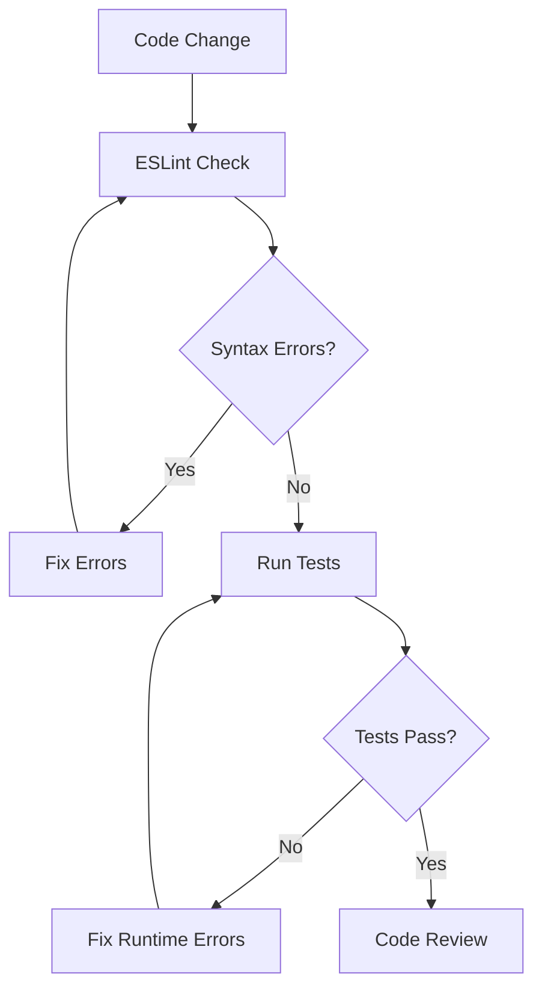

# Syntax and Runtime Errors Analysis

## Overview

This document identifies syntax errors and potential runtime errors found in the Portfolio Website codebase. The analysis covers both the legacy vanilla JavaScript implementation and the modern React-based portfolio application.

## Critical Syntax Errors

### 1. ESLint Configuration Import Error (High Priority)

**File:** `portfolio-react/eslint.config.js`  
**Line:** 5  
**Error Type:** Import Error

```javascript
import { defineConfig, globalIgnores } from 'eslint/config' // ❌ INCORRECT
```

**Issue:** The import path `eslint/config` does not exist. This is causing ESLint configuration to fail.

**Correct Solution:**
```javascript
import { defineConfig } from '@eslint/js' // ✅ CORRECT
// Remove globalIgnores import or import from correct location
```

**Impact:** ESLint will not work properly, preventing code quality checks during development and CI/CD.

### 2. Missing Variable Declaration (Medium Priority)

**File:** `assets/js/main.js`  
**Line:** 85  
**Error Type:** Variable Declaration

```javascript
sectionId = current.getAttribute('id') // ❌ Missing 'let' or 'const'
```

**Issue:** Variable `sectionId` is used without declaration, creating an implicit global variable.

**Correct Solution:**
```javascript
const sectionId = current.getAttribute('id') // ✅ CORRECT
```

**Impact:** Creates global variable pollution and potential conflicts.

### 3. Duplicate Input Field Selection (Medium Priority)

**File:** `assets/js/main.js`  
**Lines:** 159-160  
**Error Type:** Logic Error

```javascript
const formData = {
    name: document.querySelector(".contact__form input[type='text']").value,
    email: document.querySelector(".contact__form input[type='email']").value,
    project: document.querySelector(".contact__form input[type='text']").value, // ❌ Same selector as name
    message: document.querySelector(".contact__form textarea").value,
};
```

**Issue:** Both `name` and `project` fields use the same CSS selector, causing the project field to get the name field's value.

**Correct Solution:**
```javascript
const formData = {
    name: document.querySelector(".contact__form input[name='name']").value,
    email: document.querySelector(".contact__form input[type='email']").value,
    project: document.querySelector(".contact__form input[name='project']").value, // ✅ CORRECT
    message: document.querySelector(".contact__form textarea").value,
};
```

## Potential Runtime Errors

### 1. Null Reference Errors (High Priority)

**File:** `assets/js/main.js`  
**Lines:** Multiple locations  
**Error Type:** Null Reference

Several DOM queries could return `null` if elements don't exist:

```javascript
// Potential null references:
const navMenu = document.getElementById('nav-menu') // Could be null
const themeButton = document.getElementById('theme-button') // Could be null
document.querySelector('.nav__menu a[href*=' + sectionId + ']') // Could be null
```

**Risk Level:** High - Will cause `TypeError: Cannot read property 'classList' of null`

**Solution Pattern:**
```javascript
// Add null checks
const navMenu = document.getElementById('nav-menu')
if (navMenu) {
    // Safe to use navMenu
}

// Or use optional chaining
document.querySelector('.nav__menu a[href*=' + sectionId + ']')?.classList.add('active-link')
```

### 2. EmailJS Initialization Conflicts (Medium Priority)

**Files:** 
- `assets/js/main.js` (Line 153)
- `portfolio-react/src/services/emailService.js` (Line 9)

**Error Type:** Dual Initialization

Both files initialize EmailJS which could cause conflicts:

```javascript
// In main.js
emailjs.init("505hKYguhDbLkUNQi")

// In emailService.js  
emailjs.init(EMAILJS_PUBLIC_KEY)
```

**Risk:** Potential service conflicts if both scripts run simultaneously.

### 3. Missing Error Handling (Medium Priority)

**File:** `assets/js/main.js`  
**Lines:** 155-167  
**Error Type:** Unhandled Promise Rejection

```javascript
emailjs
    .send(serviceID, templateID, formData)
    .then(
        () => alert("Message sent successfully!"),
        (error) => alert("Failed to send message: " + error.text) // ❌ error.text might be undefined
    );
```

**Issue:** `error.text` property might not exist, causing additional errors.

**Solution:**
```javascript
.catch((error) => {
    const errorMessage = error?.text || error?.message || 'Unknown error occurred'
    alert("Failed to send message: " + errorMessage)
})
```

### 4. Performance Observer Browser Support (Low Priority)

**File:** `portfolio-react/src/utils/performance.js`  
**Lines:** Multiple locations  
**Error Type:** Browser Compatibility

```javascript
new PerformanceObserver((list) => {
    // Code assumes PerformanceObserver exists
}).observe({ entryTypes: ['largest-contentful-paint'] })
```

**Risk:** `PerformanceObserver` is not supported in all browsers.

**Solution:**
```javascript
if ('PerformanceObserver' in window) {
    new PerformanceObserver(/* ... */)
} else {
    // Fallback or skip performance monitoring
}
```

## React-Specific Issues

### 1. Missing Key Props (Low Priority)

**File:** Various React components  
**Error Type:** React Warning

When rendering lists, some components might be missing `key` props, though not directly visible in the examined files.

### 2. Prop Types Import Dependencies (Medium Priority)

**File:** `portfolio-react/src/components/ui/Button.jsx`  
**Line:** 2  
**Error Type:** Dependency Chain

```javascript
import { ButtonPropTypes } from '../../utils/propTypes' // Depends on correct PropTypes export
```

**Risk:** If PropTypes are not correctly exported, this will cause import errors.

## Testing Configuration Issues

### 1. Mock Implementation Dependencies (Low Priority)

**Files:** Test files (`*.test.jsx`)  
**Error Type:** Test Dependencies

Test files depend on mock implementations that may not be properly configured for all scenarios.

## Error Prevention Recommendations

### Code Quality Measures

1. **Fix ESLint Configuration Immediately**
   - Critical for development workflow
   - Prevents future syntax errors

2. **Add Null Checks for DOM Operations**
   - Use optional chaining (`?.`) where appropriate
   - Add existence checks before DOM manipulation

3. **Implement Proper Error Boundaries**
   - Add React Error Boundaries for component error handling
   - Implement global error handlers for unhandled promises

4. **Add Browser Feature Detection**
   - Check for API availability before use
   - Provide fallbacks for unsupported features

### Development Workflow



### Error Monitoring Strategy

1. **Development Phase**
   - Enable strict ESLint rules
   - Use TypeScript for additional type safety
   - Implement comprehensive testing

2. **Production Phase**
   - Add error tracking (e.g., Sentry)
   - Monitor console errors
   - Track user interaction errors

## Testing Strategy

### Unit Testing Focus Areas

1. **DOM Manipulation Functions**
   - Test with missing elements
   - Verify null handling

2. **Form Validation**
   - Test empty inputs
   - Test invalid email formats
   - Test network failures

3. **Theme System**
   - Test localStorage availability
   - Test system preference detection

### Integration Testing

1. **EmailJS Integration**
   - Test service initialization
   - Test form submission flow
   - Test error scenarios

2. **Navigation System**
   - Test section detection
   - Test scroll behavior
   - Test responsive navigation