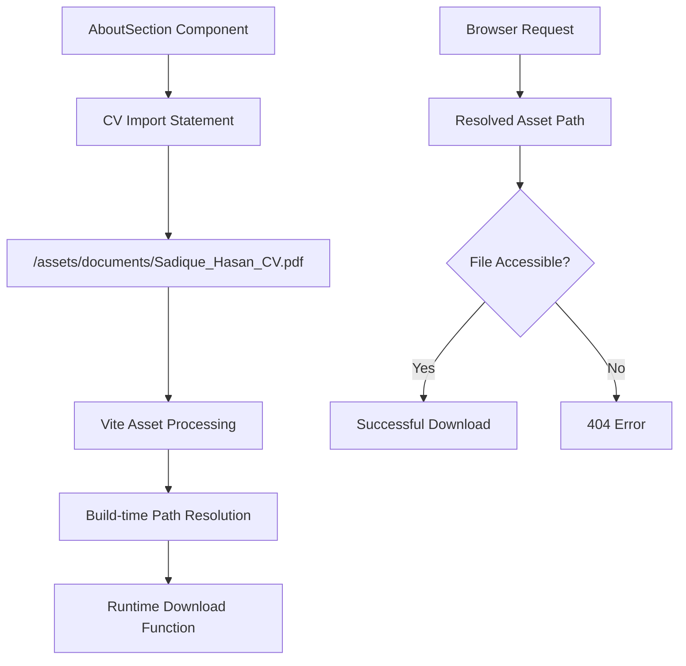
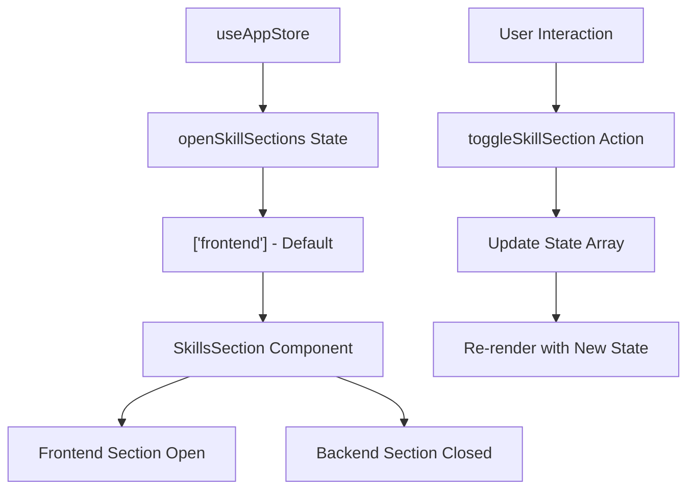
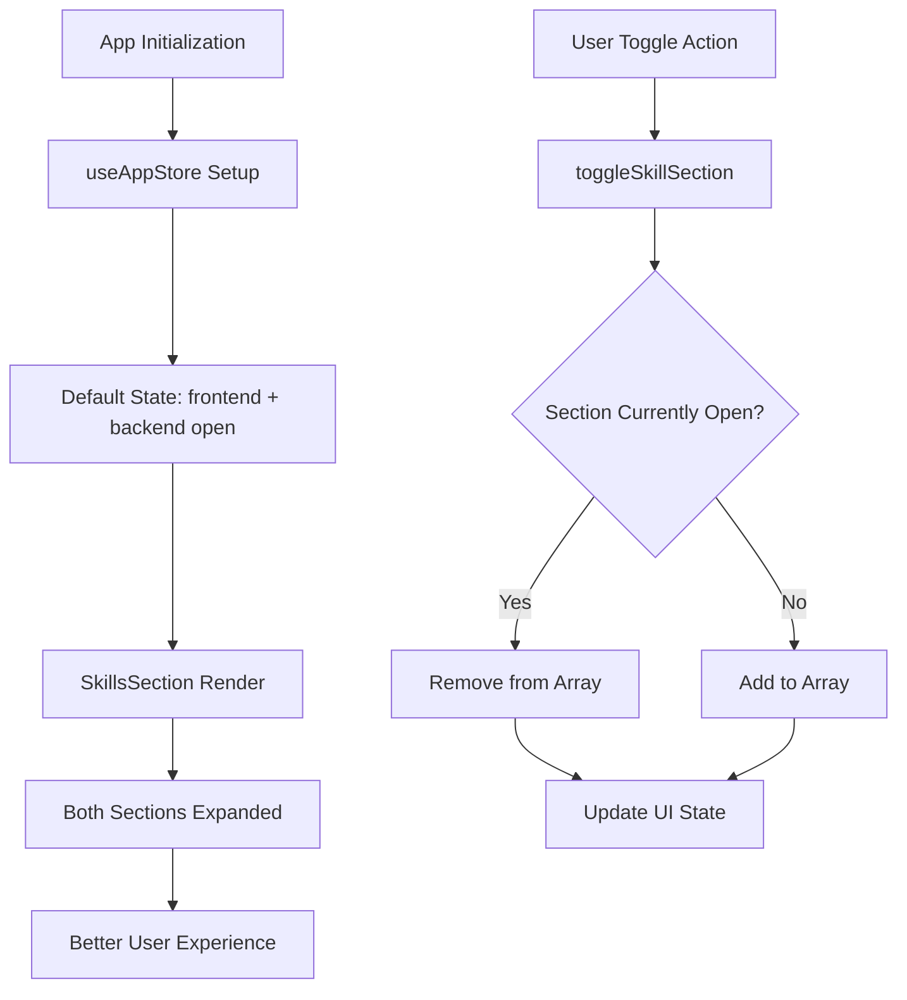
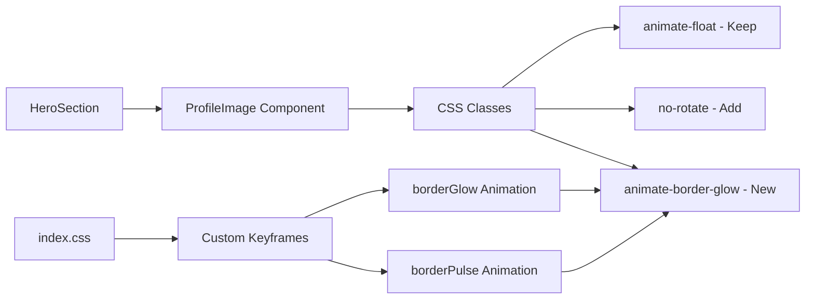
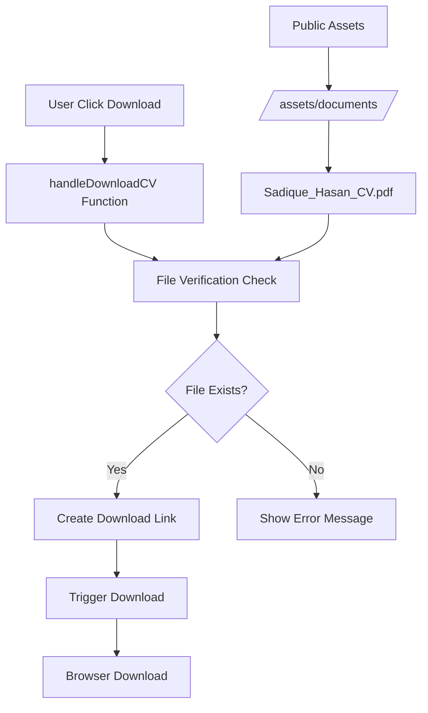
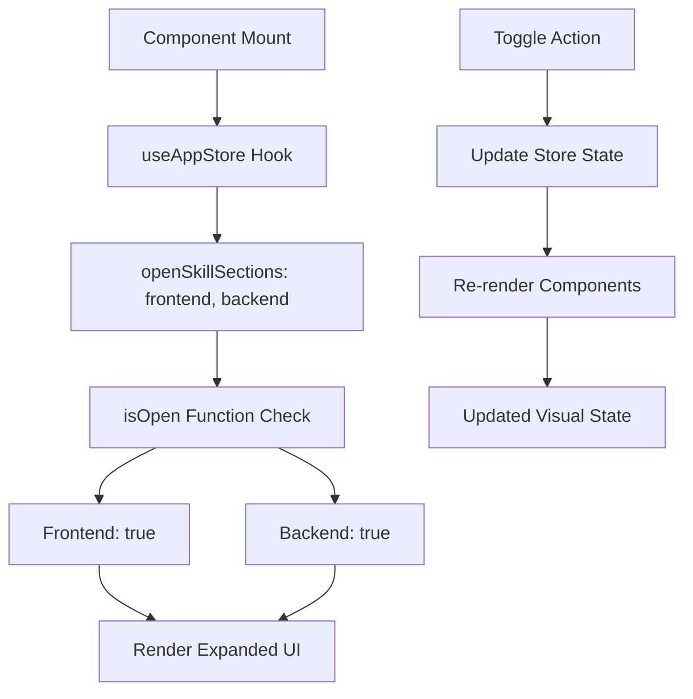

# Fix Rotating Image and PDF Path Issues

## Overview
This design addresses three critical UI/UX improvements for the portfolio website:
1. **Stop Profile Image Rotation**: Remove unwanted rotation animations and add custom border animations
2. **Fix PDF Download Path**: Correct the CV download functionality with proper file path resolution
3. **Default Skills Sections State**: Make both frontend and backend skills sections open by default for better user experience

## Repository Type
**Frontend Application** - React-based portfolio website with Vite build tool, TailwindCSS styling, and Zustand state management.

## Architecture

### Current Implementation Analysis

#### Profile Image Rotation Issue
```mermaid
graph TD
    A[HeroSection] --> B[ProfileImage Component]
    B --> C[CSS Classes Applied]
    C --> D[animate-float ✓]
    C --> E[animate-rotate-slow ❌]
    E --> F[Unwanted Rotation Effect]
    
    G[CSS Keyframes] --> H[@keyframes rotate]
    H --> I[360deg rotation every 10s]
    I --> F
```

**Current State:**
- Profile image has `animate-rotate-slow` class applied to decorative rings
- CSS animation rotates elements 360 degrees every 10 seconds
- Float animation works correctly
- Border rings rotate creating visual distraction

#### PDF Path Resolution Issue


**Current State:**
- CV import uses relative path in public directory
- Vite processes the asset correctly
- Download function creates proper anchor element
- File exists at `/public/assets/documents/Sadique_Hasan_CV.pdf`

#### Skills Section State Management


**Current State:**
- Only `frontend` section is open by default
- Backend section requires user interaction to open
- Poor initial visual presentation with collapsed content

## Component Architecture

### ProfileImage Enhancement Design

#### Remove Rotation Animation
```jsx
// Current problematic implementation
<div className="absolute inset-0 rounded-full border-4 border-primary-200 dark:border-primary-800 animate-pulse animate-rotate-slow" />

// Proposed solution
<div className="absolute inset-0 rounded-full border-4 border-primary-200 dark:border-primary-800 animate-pulse animate-border-glow" />
```

#### Custom Border Animation Implementation
```css
/* New border animation keyframes */
@keyframes borderGlow {
  0%, 100% {
    border-color: rgb(59 130 246 / 0.3);
    box-shadow: 0 0 20px rgb(59 130 246 / 0.2);
  }
  50% {
    border-color: rgb(34 197 94 / 0.5);
    box-shadow: 0 0 30px rgb(34 197 94 / 0.3);
  }
}

@keyframes borderPulse {
  0%, 100% {
    transform: scale(1);
    opacity: 0.7;
  }
  50% {
    transform: scale(1.05);
    opacity: 1;
  }
}

.animate-border-glow {
  animation: borderGlow 4s ease-in-out infinite;
}

.animate-border-pulse {
  animation: borderPulse 3s ease-in-out infinite;
}
```

### PDF Download Path Correction

#### Asset Path Resolution Strategy
```jsx
// Current implementation
import CV from '/assets/documents/Sadique_Hasan_CV.pdf'

// Enhanced implementation with fallback
const CV_PATH = '/assets/documents/Sadique_Hasan_CV.pdf'

const handleDownloadCV = async () => {
  try {
    // Verify file accessibility
    const response = await fetch(CV_PATH)
    if (!response.ok) {
      throw new Error(`File not found: ${response.status}`)
    }
    
    // Create download link
    const link = document.createElement('a')
    link.href = CV_PATH
    link.download = 'Sadique_Hasan_CV.pdf'
    link.setAttribute('target', '_blank')
    link.setAttribute('rel', 'noopener noreferrer')
    
    document.body.appendChild(link)
    link.click()
    document.body.removeChild(link)
  } catch (error) {
    console.error('CV download failed:', error)
    // Fallback: show error message to user
    alert('Sorry, the CV file is temporarily unavailable. Please try again later.')
  }
}
```

#### File Verification System
```jsx
// Pre-load verification hook
const useFileVerification = (filePath) => {
  const [isAvailable, setIsAvailable] = useState(false)
  const [isLoading, setIsLoading] = useState(true)
  
  useEffect(() => {
    const verifyFile = async () => {
      try {
        const response = await fetch(filePath, { method: 'HEAD' })
        setIsAvailable(response.ok)
      } catch {
        setIsAvailable(false)
      } finally {
        setIsLoading(false)
      }
    }
    
    verifyFile()
  }, [filePath])
  
  return { isAvailable, isLoading }
}
```

### Skills Section State Enhancement

#### Updated Default State Configuration
```javascript
// Current store configuration
openSkillSections: ['frontend'], // Only frontend open

// Enhanced configuration
openSkillSections: ['frontend', 'backend'], // Both sections open by default
```

#### State Management Flow


## Data Flow Diagrams

### Profile Image Animation Data Flow


### PDF Download Data Flow


### Skills Section State Flow


## Implementation Requirements

### CSS Animation Updates
- Remove `animate-rotate-slow` from decorative rings
- Add new `animate-border-glow` and `animate-border-pulse` classes
- Implement custom keyframe animations for border effects
- Maintain existing `animate-float` for subtle movement

### Component Modifications
1. **HeroSection.jsx**: Update ProfileImage decorative ring classes
2. **index.css**: Add new animation keyframes and utility classes
3. **useAppStore.js**: Update default openSkillSections array
4. **AboutSection.jsx**: Enhance CV download with error handling

### Error Handling Strategy
- File verification before download attempt
- User feedback for failed downloads
- Graceful degradation for missing assets
- Console logging for debugging

### Performance Considerations
- Lazy load CV file verification
- Optimize animation performance with GPU acceleration
- Minimize state updates in skills section
- Use CSS transitions for smooth state changes

## Testing Strategy

### Unit Testing Requirements
```javascript
// ProfileImage animation tests
describe('ProfileImage Animations', () => {
  it('should not have rotate animation classes', () => {
    const { container } = render(<ProfileImage />)
    expect(container.querySelector('.animate-rotate-slow')).toBeNull()
  })
  
  it('should have custom border animation classes', () => {
    const { container } = render(<ProfileImage />)
    expect(container.querySelector('.animate-border-glow')).toBeTruthy()
  })
})

// PDF download tests
describe('CV Download', () => {
  it('should handle download success', async () => {
    global.fetch = jest.fn().mockResolvedValue({ ok: true })
    const { getByText } = render(<AboutSection />)
    
    fireEvent.click(getByText(/download cv/i))
    await waitFor(() => {
      expect(global.fetch).toHaveBeenCalledWith('/assets/documents/Sadique_Hasan_CV.pdf')
    })
  })
  
  it('should handle download failure gracefully', async () => {
    global.fetch = jest.fn().mockRejectedValue(new Error('File not found'))
    const alertSpy = jest.spyOn(window, 'alert').mockImplementation()
    
    const { getByText } = render(<AboutSection />)
    fireEvent.click(getByText(/download cv/i))
    
    await waitFor(() => {
      expect(alertSpy).toHaveBeenCalled()
    })
  })
})

// Skills section tests
describe('Skills Section Default State', () => {
  it('should have both frontend and backend open by default', () => {
    const { container } = render(<SkillsSection />)
    
    expect(container.querySelector('[data-testid="frontend-skills"]')).toHaveClass('max-h-96')
    expect(container.querySelector('[data-testid="backend-skills"]')).toHaveClass('max-h-96')
  })
})
```

### Integration Testing
- Verify profile image renders without rotation
- Test CV download functionality across browsers
- Confirm skills sections display expanded by default
- Validate animation performance across devices

### Visual Regression Testing
- Screenshot comparison for profile image animations
- Border animation consistency check
- Skills section layout validation
- Mobile responsiveness verification