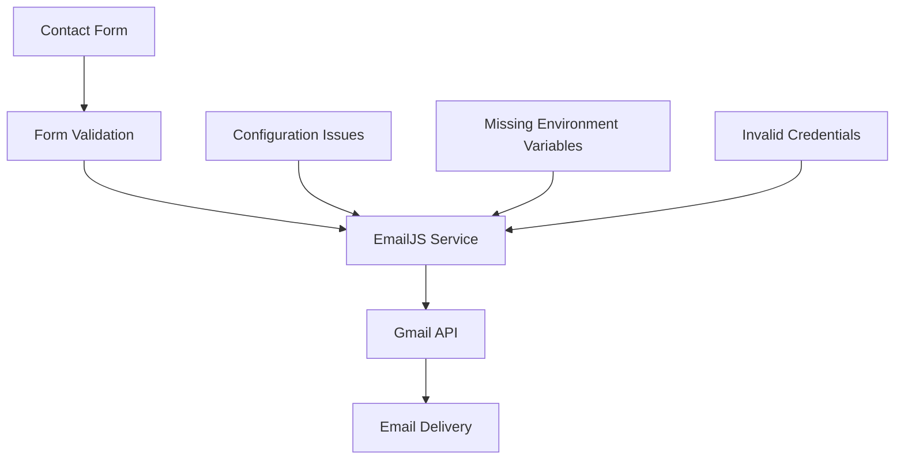
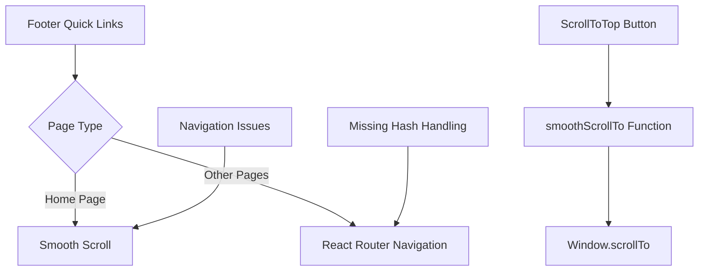
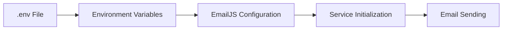
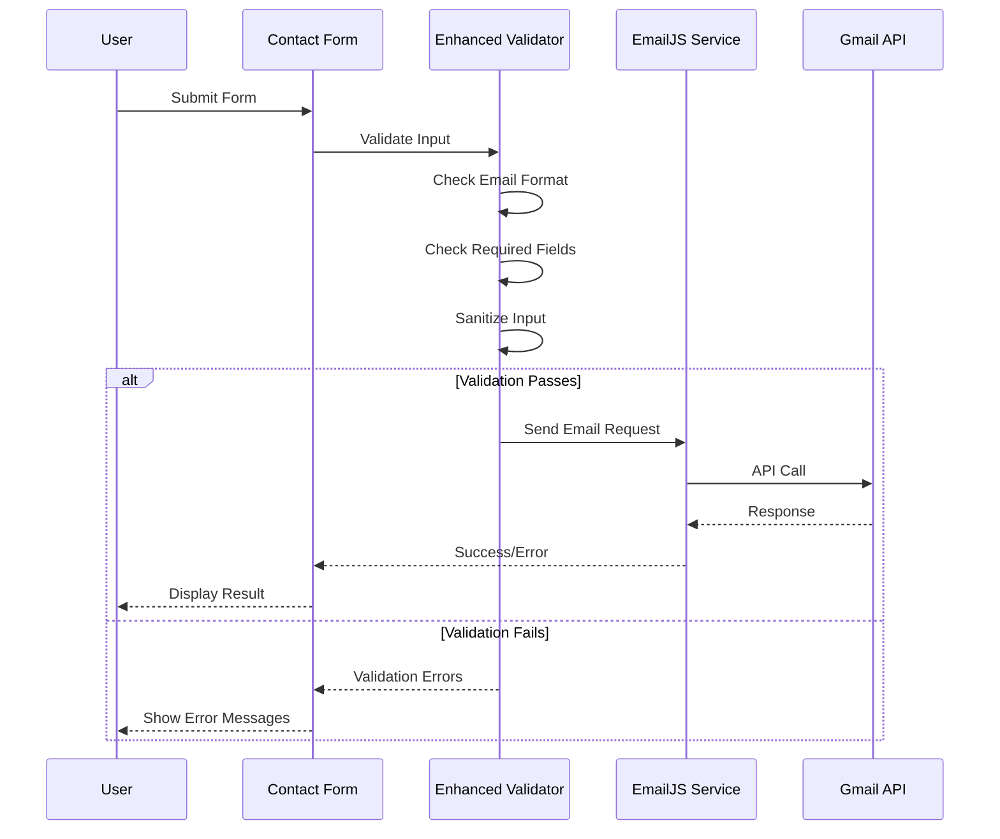
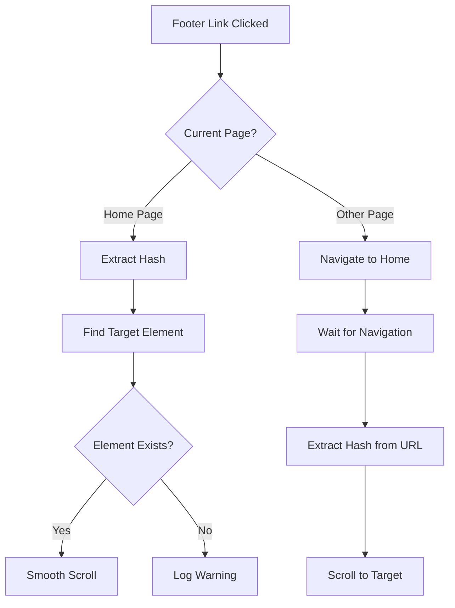
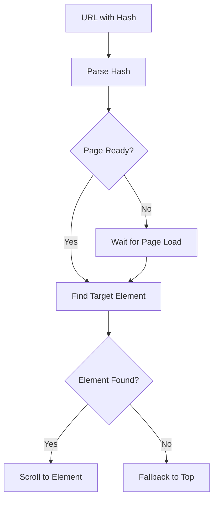
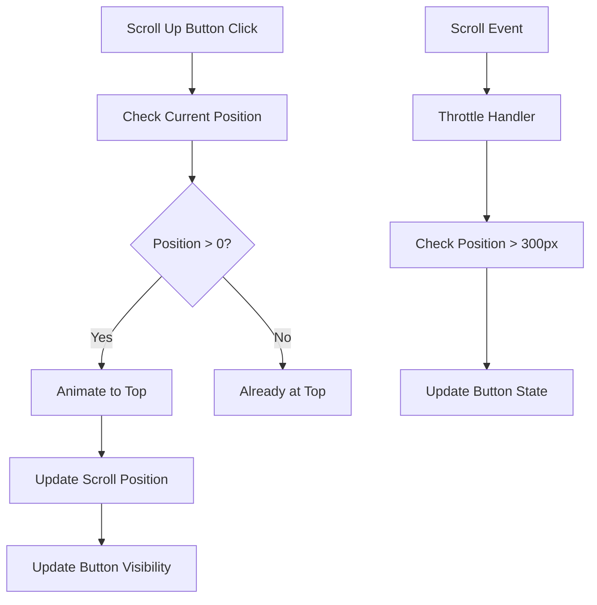
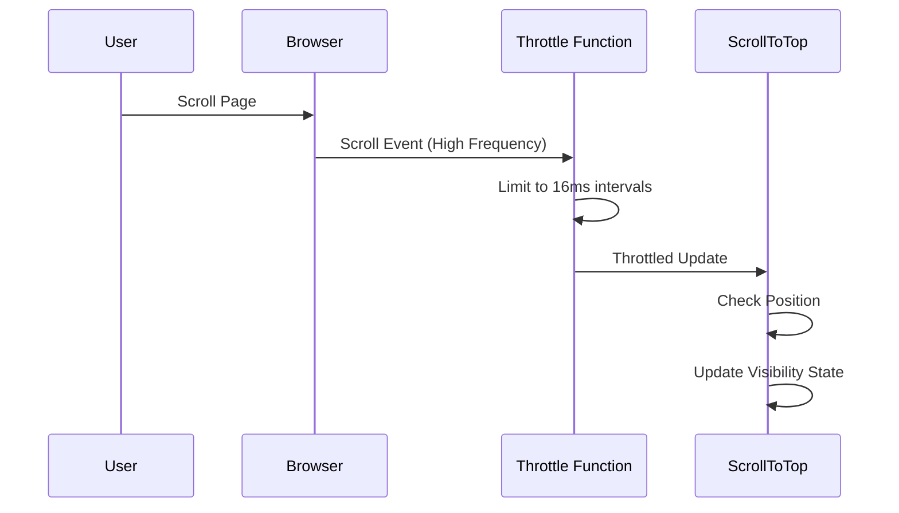
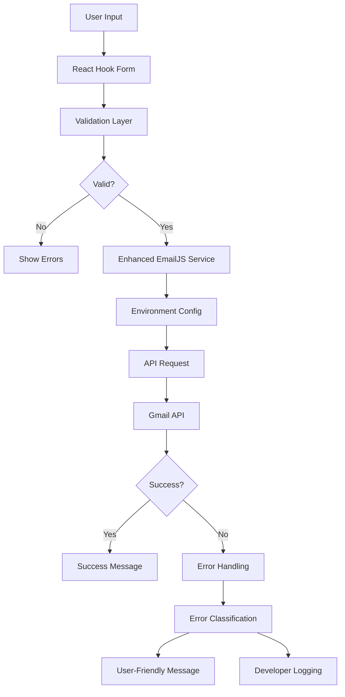
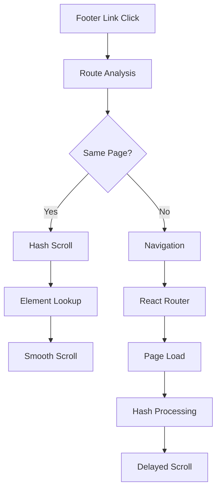

# Gmail API Validation, Footer Fix, and Scroll Up Button Enhancement

## Overview

This design addresses three critical issues in the portfolio website:
1. **Gmail API Integration Errors** - Email service configuration and validation issues causing form submission failures
2. **Footer Quick Links Not Working** - Navigation issues preventing proper routing and scrolling functionality 
3. **Scroll Up Button Enhancement** - Non-functional scroll behavior and visual improvements

The current implementation has configuration gaps, routing inconsistencies, and missing scroll functionality that need systematic resolution.

## Technology Stack & Dependencies

**Current Stack:**
- React 19.1.1 with React Router DOM 7.8.2
- EmailJS Browser 4.4.1 for email service
- React Hook Form 7.62.0 for form validation
- Zustand 5.0.8 for state management
- TailwindCSS 3.4.15 for styling
- Vite 7.1.2 as build tool

**Key Libraries:**
- `@emailjs/browser` - Email service integration
- `react-router-dom` - Client-side routing
- `react-hook-form` - Form validation and management

## Architecture Analysis

### Current Email Service Architecture

### Current Navigation Architecture

## Gmail API Validation Issues & Solutions

### Issue Analysis

1. **Hard-coded Configuration**: EmailJS credentials exposed in source code
2. **Missing Environment Variables**: No `.env` file for secure configuration
3. **Invalid Service Configuration**: Potential mismatch between EmailJS dashboard and code
4. **Error Handling Gaps**: Insufficient error feedback for debugging

### Solution Design

#### 1. Environment Configuration Setup

Create secure environment variable configuration:

**Environment Variables Structure:**
- `VITE_EMAILJS_SERVICE_ID` - EmailJS service identifier
- `VITE_EMAILJS_TEMPLATE_ID` - Email template identifier  
- `VITE_EMAILJS_PUBLIC_KEY` - Public API key
- `VITE_EMAILJS_PRIVATE_KEY` - Optional private key for enhanced security

#### 2. Enhanced Email Service Module

**Service Layer Improvements:**

| Component | Current Issue | Solution |
|-----------|---------------|----------|
| Configuration | Hard-coded values | Environment variables |
| Initialization | Single init call | Proper error handling with retry |
| Validation | Basic email regex | Enhanced validation with domain checks |
| Error Handling | Generic messages | Specific error codes and user-friendly messages |
| Security | Public key exposure | Environment-based configuration |

#### 3. Validation Enhancement

**Form Validation Flow:**

#### 4. Enhanced Error Handling

**Error Classification System:**

| Error Type | User Message | Developer Action |
|------------|--------------|------------------|
| Network Error | "Connection issue. Please try again." | Log detailed network info |
| Invalid Credentials | "Service temporarily unavailable." | Check EmailJS configuration |
| Rate Limit | "Too many requests. Please wait." | Implement client-side throttling |
| Validation Error | "Please check your input." | Show specific field errors |
| Server Error | "Service error. Please try later." | Log server response details |

## Footer Quick Links Fix

### Issue Analysis

1. **Hash Navigation Inconsistency**: Links using `/#about` format not properly handled
2. **Cross-Page Navigation**: Footer links don't work when navigating from other pages
3. **Scroll Timing Issues**: Race conditions between page load and scroll execution

### Solution Design

#### 1. Navigation Strategy Enhancement

**Routing Logic Flow:**

#### 2. Enhanced Link Handling

**Footer Navigation Component Improvements:**

| Component | Current Behavior | Enhanced Behavior |
|-----------|------------------|-------------------|
| About Link | `to="/#about"` with basic handler | Smart routing with hash persistence |
| Other Links | Direct routing only | Conditional scroll vs navigate |
| Error Handling | Console warnings | User feedback and fallback actions |
| State Management | No state tracking | Active section tracking |

#### 3. Hash-based Navigation System

**URL Hash Processing:**

## Scroll Up Button Enhancement

### Issue Analysis

1. **Scroll Function Bug**: `smoothScrollTo('', 0)` incorrect parameter usage
2. **Visual Design**: Basic styling needs enhancement for better UX
3. **Performance**: No throttling on scroll event listener
4. **Accessibility**: Missing focus management and keyboard support

### Solution Design

#### 1. Functional Improvements

**Corrected Scroll Implementation:**

#### 2. Visual Enhancement Design

**Button State System:**

| State | Visibility | Animation | Styling |
|-------|------------|-----------|---------|
| Hidden | `opacity-0` | `translate-y-16` | Pointer events disabled |
| Visible | `opacity-100` | `translate-y-0` | Full interaction enabled |
| Hover | Enhanced shadow | Scale transform | Color transition |
| Active | Pressed effect | Scale down | Immediate feedback |
| Focus | Focus ring | Outline visible | Keyboard accessible |

#### 3. Performance Optimization

**Scroll Event Optimization:**

#### 4. Enhanced Visual Design

**Button Design Specifications:**

| Property | Current Value | Enhanced Value | Purpose |
|----------|---------------|----------------|---------|
| Size | `p-3` (12px padding) | `p-4` (16px padding) | Better touch target |
| Shadow | `shadow-lg` | `shadow-xl hover:shadow-2xl` | Enhanced depth |
| Colors | Single primary color | Gradient with hover states | Modern appearance |
| Animation | Basic transition | Micro-interactions | Improved feedback |
| Icon | Static arrow | Animated icon | Visual enhancement |

## Data Flow Architecture

### Email Service Data Flow

### Navigation Data Flow

## Component Architecture

### Enhanced EmailJS Service Component

**Service Module Structure:**

| Module | Responsibility | Dependencies |
|--------|----------------|--------------|
| Configuration | Environment variable management | `import.meta.env` |
| Validation | Input sanitization and checks | Custom validators |
| API Client | EmailJS wrapper with error handling | `@emailjs/browser` |
| Error Handler | Error classification and messaging | Custom error types |
| Logger | Development logging and debugging | Console API |

### Enhanced Footer Component

**Navigation Enhancement:**

| Component | Current Implementation | Enhanced Implementation |
|-----------|----------------------|------------------------|
| Link Handler | Basic onClick with scroll | Smart routing with state management |
| URL Processing | Simple hash extraction | Robust URL parsing with validation |
| Error Handling | Console warnings | User feedback and fallback navigation |
| State Tracking | No active section tracking | Synchronized active state management |

### Enhanced ScrollToTop Component

**Component Structure:**

| Feature | Implementation | Purpose |
|---------|----------------|---------|
| Visibility Logic | Threshold-based display | Performance optimized detection |
| Scroll Animation | Native smooth scroll with fallback | Cross-browser compatibility |
| Event Handling | Throttled scroll listeners | Performance optimization |
| Accessibility | Keyboard support and ARIA labels | Inclusive design |
| Visual Effects | Enhanced CSS transitions | Modern user experience |

## Testing Strategy

### Email Service Testing

**Test Scenarios:**

| Test Case | Input | Expected Output | Validation |
|-----------|-------|----------------|------------|
| Valid Form | Complete form data | Success message | Email received |
| Invalid Email | Malformed email | Validation error | Form highlights error |
| Network Error | Valid data, no connection | Network error message | Graceful degradation |
| Rate Limiting | Multiple rapid submissions | Rate limit message | Throttling active |
| Empty Fields | Missing required fields | Field-specific errors | Form validation working |

### Navigation Testing

**Test Scenarios:**

| Test Case | Action | Expected Result | Validation |
|-----------|--------|----------------|------------|
| Footer Link from Home | Click "About" | Scroll to about section | Section visible |
| Footer Link from Other Page | Click "About" from Projects | Navigate home, scroll to about | URL updated, section visible |
| Hash URL Direct Access | Visit `/#about` | Load home, scroll to about | Direct navigation working |
| Missing Section | Click link to non-existent section | Graceful fallback | Error handling active |

### Scroll Button Testing

**Test Scenarios:**

| Test Case | Action | Expected Result | Validation |
|-----------|--------|----------------|------------|
| Button Visibility | Scroll down 300px+ | Button appears | Opacity transition smooth |
| Scroll to Top | Click button | Smooth scroll to top | Animation smooth, position accurate |
| Keyboard Access | Tab to button, press Enter | Focus visible, scroll triggered | Accessibility working |
| Performance | Rapid scrolling | No lag or jank | Throttling effective |

## Security Considerations

### Email Service Security

| Risk | Current State | Mitigation Strategy |
|------|---------------|-------------------|
| API Key Exposure | Keys in source code | Environment variables |
| Spam Prevention | No protection | Rate limiting implementation |
| Input Sanitization | Basic validation | Enhanced sanitization |
| Error Information Leakage | Detailed errors in production | Environment-based error handling |

### Navigation Security

| Risk | Current State | Mitigation Strategy |
|------|---------------|-------------------|
| XSS in Hash Parameters | Basic hash handling | URL sanitization |
| Uncontrolled Redirects | Open redirects possible | Whitelist validation |
| State Manipulation | Client-side state only | Validation on route change |