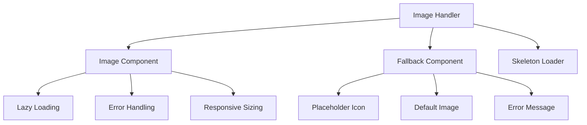
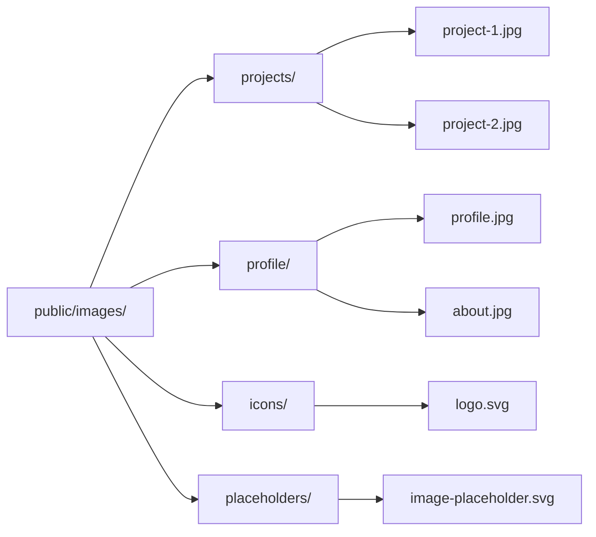
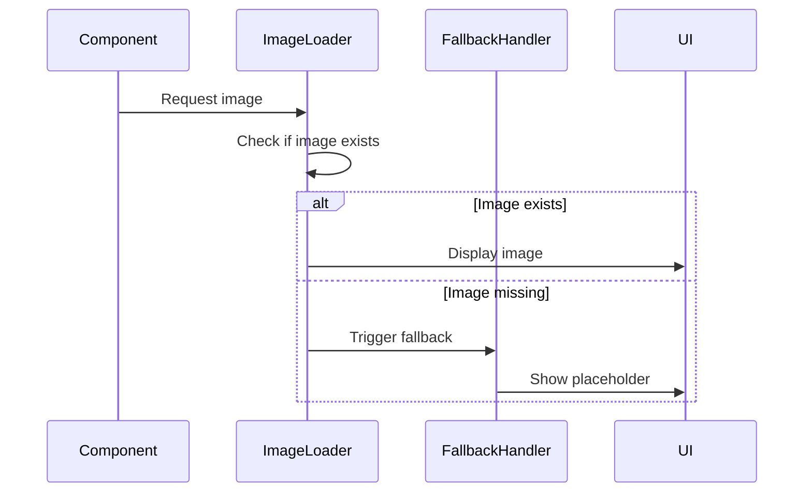
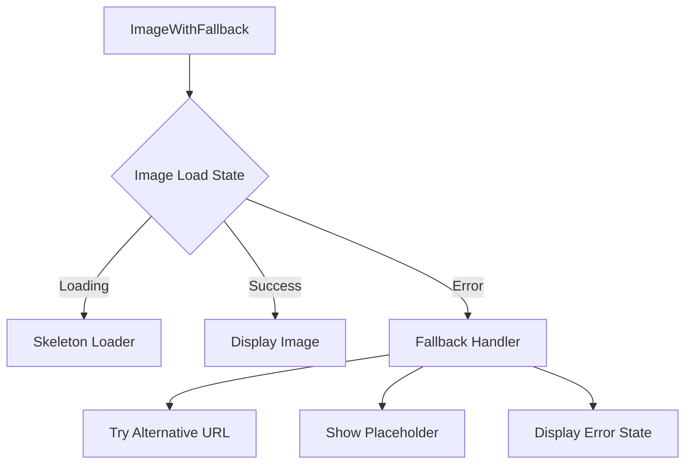

# Missing Images Handling Design

## Overview

The portfolio website currently has missing images that are not displaying properly. Based on the codebase analysis, there are several image-related issues that need to be addressed:

1. **Project Images**: Portfolio data references images at `/images/` path that don't exist
2. **Profile Images**: React components use placeholder icons instead of actual images
3. **Asset Management**: Images exist in `assets/img/` but aren't properly integrated with React app
4. **Fallback Mechanisms**: No proper handling for missing or broken images

## Technology Stack & Dependencies

- **Frontend Framework**: React 18 with Vite
- **Styling**: TailwindCSS 3.4.15
- **Icons**: Unicons library
- **Image Optimization**: Custom utilities in `utils/performance.js`
- **Build Tool**: Vite with static asset handling

## Component Architecture

### Image Component Structure



### Component Hierarchy

- **ImageWithFallback**: Main image component with error handling
- **ProjectCard**: Enhanced project display with image management
- **ProfileImage**: Dedicated profile image component
- **LazyImage**: Performance-optimized image loading
- **ImagePlaceholder**: Fallback UI component

## Image Management Architecture

### Asset Organization Strategy



### Image Loading Flow



## Data Models & Image References

### Enhanced Project Data Model

```javascript
// Project data structure with image configuration
const projectDataExample = {
  id: 'honey-website',
  title: 'Honey Selling Website',
  description: 'A modern e-commerce website...',
  technologies: ['HTML', 'CSS', 'JavaScript'],
  image: {
    src: '/images/projects/honey-website.jpg',
    alt: 'Honey selling website screenshot',
    fallback: '/images/placeholders/project-placeholder.svg',
    placeholder: '/images/placeholders/loading.svg'
  },
  liveUrl: 'https://example.com',
  githubUrl: 'https://github.com/user/project',
  featured: true
}
```

### Image Configuration Structure

```javascript
// Image configuration object structure
const imageConfigExample = {
  src: '/images/profile/about.jpg',
  alt: 'Profile picture',
  fallback: '/images/placeholders/user-placeholder.svg',
  loading: 'lazy', // or 'eager'
  aspectRatio: '1/1',
  sizes: '(max-width: 768px) 100vw, 50vw',
  className: 'rounded-full'
}
```

## Business Logic Layer

### Image Handling Service

#### Core Functionality
- **Image Validation**: Check if image URL is accessible
- **Fallback Management**: Provide appropriate fallbacks for missing images
- **Performance Optimization**: Implement lazy loading and progressive enhancement
- **Error Recovery**: Handle network failures and broken image links

#### Image Resolution Strategy
1. **Primary Image**: Try to load the specified image
2. **CDN Fallback**: Attempt backup image from CDN
3. **Local Fallback**: Use local placeholder image
4. **Icon Fallback**: Display relevant icon as last resort

### Placeholder Generation

#### Dynamic Placeholders
- **Text-based**: Generate initials or abbreviations
- **Icon-based**: Use relevant icons from Unicons library
- **Gradient**: Create visually appealing color gradients
- **SVG Patterns**: Custom SVG patterns for different content types

## Image Handling Components

### ImageWithFallback Component



### ProjectCard Enhanced

#### Features
- **Image Optimization**: Responsive images with proper sizing
- **Lazy Loading**: Load images only when in viewport
- **Error Handling**: Graceful degradation for missing images
- **Accessibility**: Proper alt text and ARIA labels

### ProfileImage Component

#### Functionality
- **Multiple Sources**: Support for different image formats
- **Responsive Design**: Adapt to different screen sizes
- **Theme Integration**: Work with dark/light theme system
- **Animation Support**: Smooth transitions and hover effects

## Middleware & Interceptors

### Image Loading Interceptor

#### Request Processing
- **URL Validation**: Ensure image URLs are valid
- **Cache Management**: Implement browser caching strategies
- **Performance Monitoring**: Track image loading metrics
- **Error Logging**: Log failed image requests

### Lazy Loading Manager

#### Implementation Strategy
- **Intersection Observer**: Monitor element visibility
- **Progressive Loading**: Load images based on priority
- **Bandwidth Consideration**: Adapt loading strategy based on connection
- **Memory Management**: Cleanup unused image resources

## Testing Strategy

### Unit Testing
- **Component Rendering**: Test image components with various states
- **Error Handling**: Verify fallback mechanisms work correctly
- **Performance**: Test lazy loading and optimization features
- **Accessibility**: Ensure proper ARIA attributes and alt text

### Integration Testing
- **Data Flow**: Test image data propagation through components
- **Network Scenarios**: Test with slow/failed network conditions
- **Browser Compatibility**: Test across different browsers
- **Responsive Behavior**: Test on various screen sizes

### Performance Testing
- **Loading Times**: Measure image loading performance
- **Memory Usage**: Monitor memory consumption
- **Bundle Size**: Ensure image handling doesn't bloat bundle
- **Core Web Vitals**: Track impact on performance metrics

## Implementation Strategy

### Phase 1: Asset Organization
1. Create proper directory structure in `public/images/`
2. Add placeholder images for missing project screenshots
3. Optimize existing images in `assets/img/` for web
4. Create SVG placeholders for different content types

### Phase 2: Component Development
1. Build `ImageWithFallback` component
2. Create `LazyImage` with intersection observer
3. Develop `ImagePlaceholder` component
4. Build `ProjectCard` with image handling

### Phase 3: Integration
1. Update `portfolioData.js` with proper image references
2. Integrate new components into existing sections
3. Update `AboutSection` to use actual profile image
4. Enhance `Projects` page with image gallery

### Phase 4: Optimization
1. Implement progressive image loading
2. Add image compression and optimization
3. Setup CDN integration for better performance
4. Add image preloading for critical images

## Error Handling & Recovery

### Fallback Hierarchy
1. **Primary Image**: Original specified image
2. **Alternative Format**: WebP/AVIF fallback to JPEG/PNG
3. **Placeholder Image**: Generic placeholder from local assets
4. **Icon Representation**: Relevant icon from Unicons
5. **Text Placeholder**: Text-based fallback with styling

### Error States
- **Loading State**: Skeleton loader with animation
- **Error State**: User-friendly error message with retry option
- **Empty State**: Placeholder indicating no image available
- **Broken State**: Clear indication of broken image with fallback

## Performance Optimization

### Image Loading Strategies
- **Critical Images**: Preload above-the-fold images
- **Lazy Loading**: Defer non-critical image loading
- **Progressive Enhancement**: Load low-quality placeholders first
- **Format Selection**: Use modern formats (WebP, AVIF) with fallbacks

### Caching Strategy
- **Browser Cache**: Leverage browser caching with proper headers
- **Service Worker**: Implement offline image caching
- **Memory Management**: Cleanup unused images from memory
- **CDN Integration**: Use CDN for better global performance

## Accessibility Considerations

### Image Accessibility
- **Alt Text**: Meaningful descriptions for all images
- **ARIA Labels**: Proper labeling for interactive elements
- **Focus Management**: Keyboard navigation support
- **Screen Reader**: Compatible with assistive technologies

### Visual Accessibility
- **High Contrast**: Ensure sufficient contrast ratios
- **Color Independence**: Don't rely solely on color for information
- **Reduced Motion**: Respect user's motion preferences
- **Scalability**: Support for zoom and high DPI displays

## Deployment Considerations

### Build Optimization
- **Asset Optimization**: Compress images during build
- **Bundle Splitting**: Separate image-heavy components
- **Tree Shaking**: Remove unused image utilities
- **Source Maps**: Maintain debugging capabilities

### CDN Configuration
- **Image Transformation**: On-the-fly image optimization
- **Global Distribution**: Reduce latency worldwide
- **Automatic Format**: Serve optimal format based on browser
- **Compression**: Automatic image compression

## Monitoring & Analytics

### Performance Metrics
- **Image Load Times**: Track average loading performance
- **Error Rates**: Monitor failed image requests
- **User Experience**: Measure impact on user engagement
- **Core Web Vitals**: Track LCP, CLS related to images

### Error Tracking
- **Failed Requests**: Log and analyze failed image loads
- **Fallback Usage**: Track how often fallbacks are used
- **User Behavior**: Monitor user interaction with broken images
- **Performance Impact**: Measure effect on overall site performance