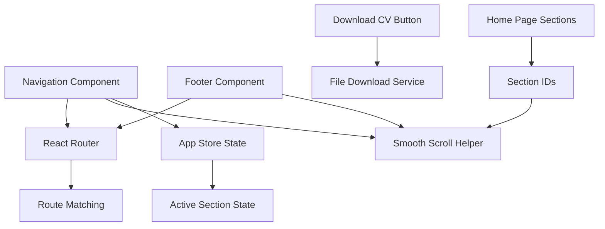
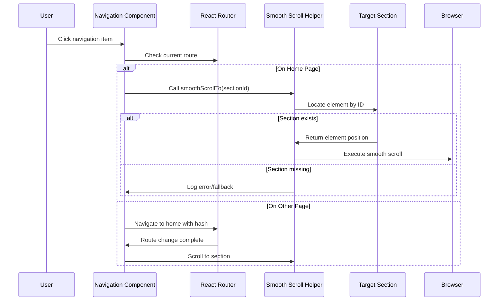
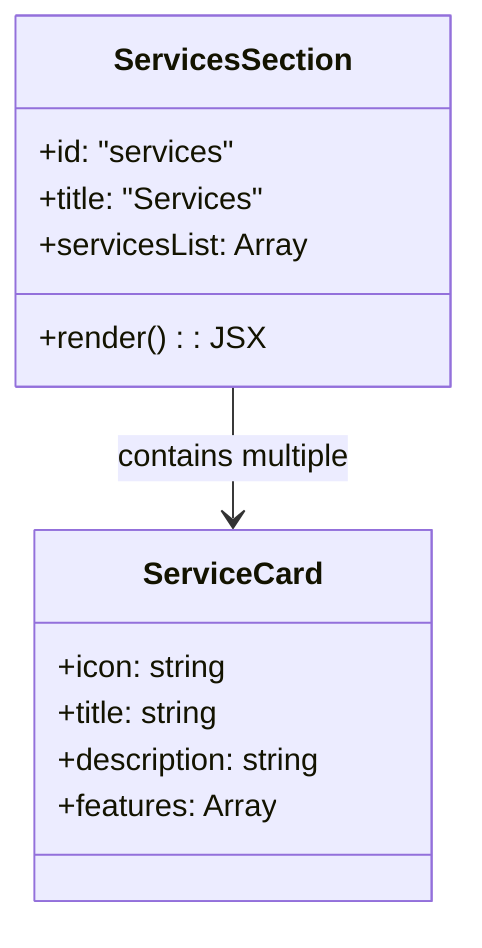
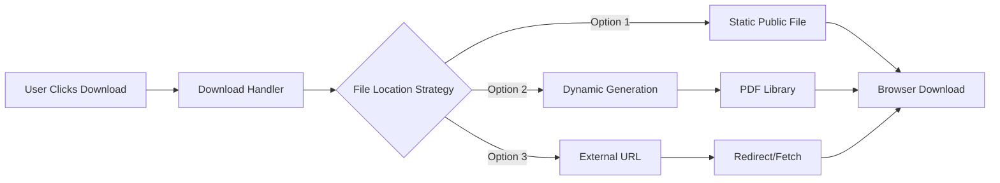

# Navigation and Button Functionality Fix Design

## Overview

The portfolio website has several navigation and interaction issues that need to be resolved:

1. **Navigation Links**: Home, Services, etc. navigation items are not working properly
2. **Download CV Button**: The download functionality is not implemented 
3. **Footer Links**: Footer navigation buttons are not functioning correctly

This design addresses the root causes and provides comprehensive solutions to ensure proper navigation flow, functional download capabilities, and working footer interactions.

## Architecture

The navigation system consists of several interconnected components:



### Current Navigation Flow Issues

| Component | Issue | Impact |
|-----------|-------|---------|
| Navigation | Hash-based links on home page not scrolling | Users can't navigate to sections |
| Footer Links | Inconsistent routing patterns | Broken user experience |
| Download CV | No click handler implementation | Button appears non-functional |
| Services Link | No services section exists | 404-like behavior |

## Navigation System Fixes

### 1. Home Page Section Navigation

**Problem**: Navigation items like "Home", "Services" etc. are not properly scrolling to their target sections.

**Root Cause Analysis**:
- Navigation component expects section IDs to exist on the home page
- Services section is referenced in navigation but doesn't exist
- Scroll functionality may be blocked by missing elements

**Solution Design**:



### 2. Services Section Implementation

**Missing Component**: The navigation references a "services" section that doesn't exist.

**Design Solution**:
- Create ServicesSection component
- Add to Home page component structure
- Include relevant services content
- Ensure proper section ID matching

**Services Section Structure**:



### 3. Footer Navigation Fixes

**Current Issues**:
- Footer links use inconsistent routing patterns
- Mix of hash-based and route-based navigation
- Some links point to non-existent sections

**Improved Footer Navigation Pattern**:

| Link Type | Current | Fixed Pattern |
|-----------|---------|---------------|
| About Me | `to="/#about"` | Detect page + scroll or navigate |
| Projects | `to="/projects"` | ✓ Correct |
| Contact | `to="/contact"` | ✓ Correct |
| Resume | `to="/resume"` | ✓ Correct |

## Download CV Functionality

### Current State Analysis

**Problem**: Download CV button exists but has no click handler implementation.

**Current Implementation**:
```javascript
<Button variant="outline" className="group hover:scale-105 transition-transform duration-300">
  Download CV 
  <i className="uil uil-download-alt ml-2 group-hover:animate-bounce"></i>
</Button>
```

### Download Implementation Design

**File Management Strategy**:



**Implementation Options**:

1. **Static File Approach** (Recommended for immediate fix)
   - Store CV PDF in public/assets/documents/
   - Simple click handler to trigger download
   - Easy to update and maintain

2. **Dynamic Generation** (Future enhancement)
   - Use PDF generation library
   - Create CV from data dynamically
   - More complex but flexible

3. **External Hosting** (Alternative)
   - Host CV on cloud storage
   - Redirect to download URL
   - Requires external dependency

**Recommended Implementation**:

```javascript
const handleDownloadCV = () => {
  const link = document.createElement('a');
  link.href = '/assets/documents/Sadique_Hasan_CV.pdf';
  link.download = 'Sadique_Hasan_CV.pdf';
  link.click();
};
```

## Component Modifications Required

### 1. Navigation Component Updates

**File**: `src/components/layout/Navigation.jsx`

**Required Changes**:
- Add error handling for missing sections
- Improve cross-page navigation logic
- Add fallback behavior for non-existent sections

### 2. Footer Component Updates

**File**: `src/components/layout/Footer.jsx`

**Required Changes**:
- Implement smart navigation for hash-based links
- Add smooth scroll for same-page navigation
- Ensure consistent behavior across all footer links

### 3. AboutSection Component Updates

**File**: `src/components/sections/AboutSection.jsx`

**Required Changes**:
- Add onClick handler to Download CV button
- Implement file download functionality
- Add error handling for missing CV file

### 4. Home Page Structure Updates

**File**: `src/pages/Home.jsx`

**Required Changes**:
- Add ServicesSection component import and usage
- Ensure proper section ordering
- Verify all navigation target sections exist

### 5. New ServicesSection Component

**File**: `src/components/sections/ServicesSection.jsx` (New)

**Component Structure**:
- Service cards with icons and descriptions
- Responsive grid layout
- Consistent styling with existing sections
- Proper section ID for navigation

## Data Structure Updates

### 1. Portfolio Data Enhancements

**File**: `src/data/portfolioData.js`

**Required Additions**:

```javascript
export const servicesData = [
  {
    id: "web-development",
    title: "Web Development",
    icon: "uil-web-grid",
    description: "Custom web applications using modern technologies",
    features: ["React/Vue.js Applications", "Responsive Design", "API Integration"]
  },
  {
    id: "backend-development", 
    title: "Backend Development",
    icon: "uil-server-network",
    description: "Scalable backend solutions with Java and Spring Boot",
    features: ["REST API Development", "Database Design", "System Architecture"]
  },
  {
    id: "problem-solving",
    title: "Problem Solving",
    icon: "uil-brain",
    description: "Algorithm design and optimization solutions",
    features: ["Data Structures", "Algorithm Optimization", "Code Review"]
  }
];
```

### 2. Navigation Data Validation

**Ensure Consistency**:
- Verify all navigationItems have corresponding sections
- Add validation for missing target elements
- Implement graceful fallback behaviors

## Testing Strategy

### 1. Navigation Testing

**Test Scenarios**:
- Click each navigation item on home page
- Test navigation from other pages
- Verify smooth scrolling behavior
- Test mobile menu functionality

### 2. Download Testing

**Test Cases**:
- CV file exists and is accessible
- Download triggers correctly
- File downloads with correct name
- Error handling for missing file

### 3. Footer Testing

**Validation Points**:
- All footer links function correctly
- Consistent behavior across device sizes
- Proper navigation between pages and sections

## Performance Considerations

### 1. Scroll Performance

**Optimization Measures**:
- Throttle scroll event listeners
- Use RAF for smooth animations
- Avoid blocking main thread during scroll

### 2. File Download Optimization

**Best Practices**:
- Compress CV file for faster downloads
- Implement download progress indication
- Cache file for repeat downloads

## Error Handling

### 1. Missing Sections

```javascript
const scrollToSection = (sectionId) => {
  const element = document.getElementById(sectionId);
  if (!element) {
    console.warn(`Section "${sectionId}" not found`);
    // Fallback: navigate to home
    return;
  }
  // Proceed with scroll
};
```

### 2. Download Failures

```javascript
const handleDownloadError = (error) => {
  console.error('Download failed:', error);
  // Show user-friendly message
  // Provide alternative download methods
};
```

## Implementation Priority

| Priority | Component | Estimated Effort | Impact |
|----------|-----------|------------------|---------|
| High | Navigation scroll fixes | 2-3 hours | Critical UX |
| High | Download CV implementation | 1-2 hours | Core functionality |
| Medium | Services section creation | 3-4 hours | Navigation completeness |
| Medium | Footer navigation fixes | 1-2 hours | Consistency |
| Low | Advanced error handling | 2-3 hours | Polish |

## Quality Assurance Checklist

- [ ] All navigation items scroll to correct sections
- [ ] Download CV button triggers file download
- [ ] Footer links navigate properly
- [ ] Mobile navigation functions correctly
- [ ] Cross-page navigation works seamlessly
- [ ] Error handling prevents crashes
- [ ] Performance remains optimal
- [ ] Accessibility standards maintained