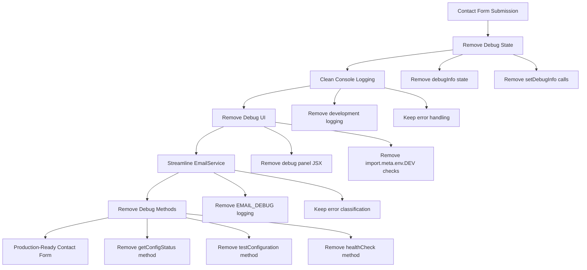
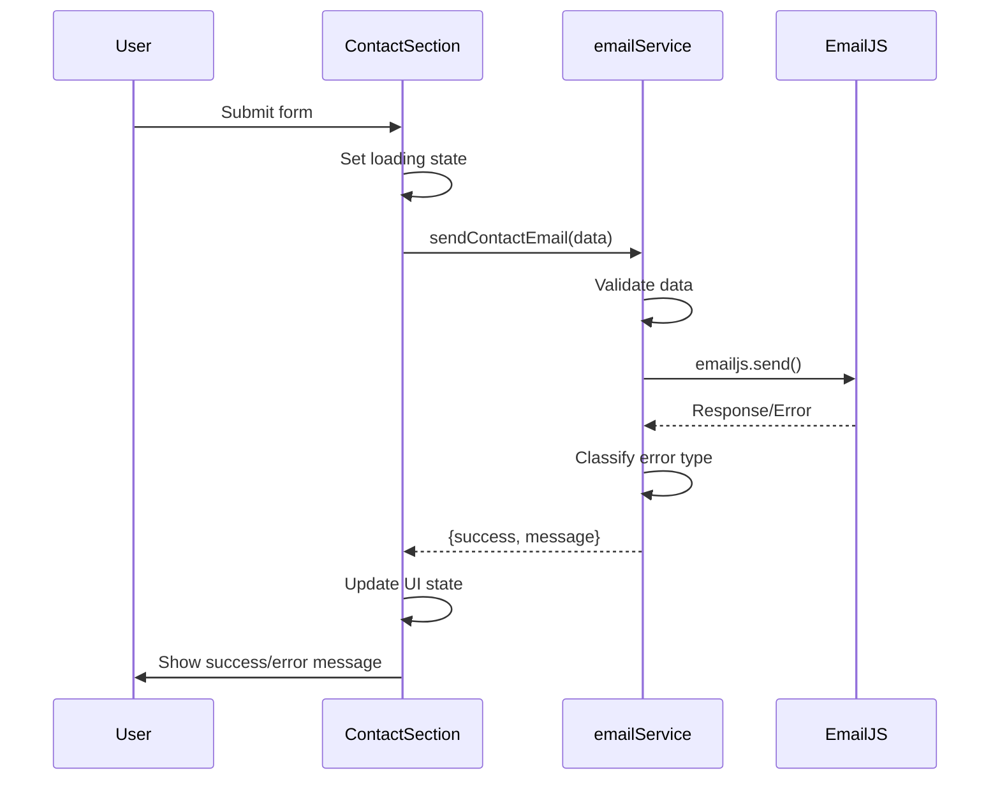

# Remove Debug Information from Contact Form

## Overview
This design document outlines the removal of debug information, development logging, and diagnostic features from the contact form components to prepare the application for production deployment. The goal is to eliminate all debug-related code while maintaining the core functionality and error handling mechanisms.

## Current Debug Information Analysis

### ContactSection Component Debug Features
1. **Debug State Management**
   - `debugInfo` state variable for storing debug data
   - `setDebugInfo()` calls throughout the submission process

2. **Development Console Logging**
   - Form submission attempt logging
   - EmailService result logging
   - Error logging with detailed stack traces

3. **Debug UI Panel**
   - Conditional debug information panel visible only in development
   - JSON dump of service response data
   - Details/summary expandable debug section

### EmailService Debug Features
1. **Environment-Based Debug Flag**
   - `EMAIL_DEBUG` environment variable controlling debug behavior
   - Extensive console logging throughout the service

2. **Debug Logging Points**
   - EmailJS initialization success/failure
   - Form validation results
   - Email configuration status
   - Detailed error information with stack traces
   - Email data and configuration logging

3. **Debug Methods**
   - `getConfigStatus()` method with detailed configuration exposure
   - `testConfiguration()` method for service testing
   - `healthCheck()` method for comprehensive diagnostics

## Architecture for Debug Removal

## Component Modifications

### ContactSection.jsx Changes

#### Remove Debug State Management
- Remove `debugInfo` state variable and `setDebugInfo` import
- Remove all `setDebugInfo()` calls in the submission handler

#### Remove Development Logging
- Remove console.log statements wrapped in `import.meta.env.DEV` conditions
- Remove error logging in catch blocks
- Maintain error handling for user feedback

#### Remove Debug UI Panel
- Remove the entire debug information panel JSX section
- Remove conditional rendering based on `import.meta.env.DEV`

### EmailService.js Changes

#### Remove Debug Configuration
- Remove `EMAIL_DEBUG` environment variable usage
- Remove all console.log and console.error statements
- Keep error classification and user-friendly error messages

#### Remove Debug Methods
- Remove `getConfigStatus()` method completely
- Remove `testConfiguration()` method completely  
- Remove `healthCheck()` method completely

#### Streamline Error Handling
- Keep error classification logic for user experience
- Remove detailed error logging and stack trace exposure
- Maintain user-friendly error messages

## Data Flow After Debug Removal

## Security and Performance Benefits

### Security Improvements
- Eliminates exposure of sensitive configuration details
- Removes potential information leakage through debug panels
- Prevents detailed error information from reaching production logs

### Performance Improvements
- Reduces bundle size by removing debug code
- Eliminates runtime overhead of debug state management
- Removes unnecessary console operations in production

### Maintenance Benefits
- Cleaner codebase without development-specific code
- Reduced complexity in production builds
- Clearer separation of concerns

## Implementation Strategy

### Phase 1: ContactSection Cleanup
1. Remove debug state variables and imports
2. Remove development-conditional logging statements
3. Remove debug UI panel JSX
4. Test form submission functionality

### Phase 2: EmailService Streamlining
1. Remove EMAIL_DEBUG configuration and logging
2. Remove debug utility methods
3. Preserve error handling and classification
4. Test email sending and error scenarios

### Phase 3: Validation
1. Verify form functionality in development
2. Test error handling scenarios
3. Confirm no debug information appears in production build
4. Validate user experience remains unchanged

## Testing Considerations

### Functionality Testing
- Form validation continues to work correctly
- Email sending functionality remains intact
- Error handling provides appropriate user feedback
- Loading states function properly

### Error Scenario Testing
- Network error handling
- Validation error display
- Service configuration errors
- Timeout handling

### UI/UX Testing  
- Form submission feedback is clear
- Error messages are user-friendly
- No debug information visible to users
- Form reset functionality works after successful submission