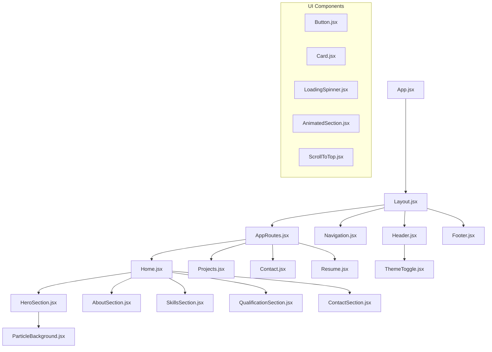
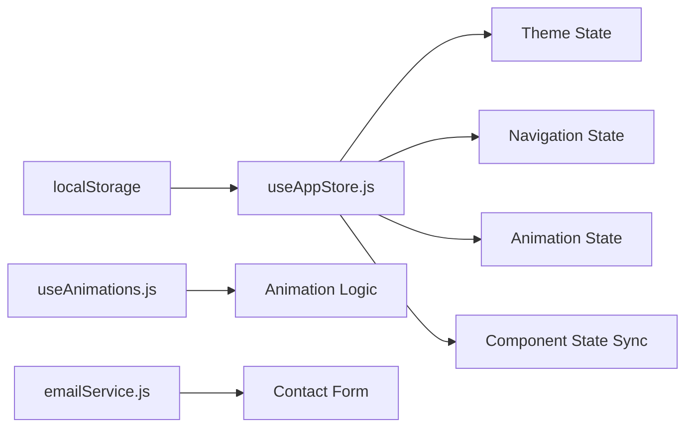
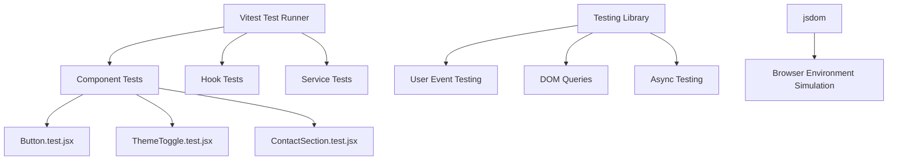

# Portfolio Website Development & Deployment Guide

## Overview

This document outlines the architecture and processes for running the Portfolio Website project, which has evolved from a static HTML/CSS/JavaScript website to a modern React-based application built with Vite. The project supports both local development and production deployment across multiple platforms.

## Technology Stack & Dependencies

### Core Technologies
- **Frontend Framework**: React 19.1.1
- **Build Tool**: Vite 7.1.2
- **Styling**: TailwindCSS 4.1.13
- **State Management**: Zustand 5.0.8
- **Routing**: React Router DOM 7.8.2
- **Animation Libraries**: Framer Motion 12.23.12, React Spring 10.0.1

### Development Dependencies
- **Testing Framework**: Vitest 3.2.4 with Testing Library
- **Linting**: ESLint 9.33.0
- **Package Manager**: npm (Node.js required)

### External Services
- **Email Service**: EmailJS Browser 4.4.1
- **Form Handling**: React Hook Form 7.62.0

## Component Architecture

### Component Hierarchy



### Component Organization
- **Layout Components**: Header, Navigation, Footer, Layout wrapper
- **Section Components**: Hero, About, Skills, Qualifications, Contact
- **UI Components**: Reusable Button, Card, LoadingSpinner, AnimatedSection
- **Page Components**: Home, Projects, Contact, Resume

### State Management Architecture



## Development Environment Setup

### Prerequisites
- Node.js (version 16 or higher)
- npm or yarn package manager
- Modern web browser
- Code editor (VS Code recommended)

### Local Development Commands

```bash
# Navigate to React project directory
cd portfolio-react

# Install dependencies
npm install

# Start development server
npm run dev

# Run tests
npm test

# Run tests with UI
npm run test:ui

# Run tests with coverage
npm run test:coverage

# Run linting
npm run lint
```

### Development Server Configuration
- **Local URL**: http://localhost:5173 (default Vite port)
- **Hot Module Replacement**: Enabled via Vite
- **Development Mode**: Optimized for fast rebuilds and debugging

## Build & Production Deployment

### Build Process

```bash
# Create production build
npm run build

# Preview production build locally
npm run preview
```

### Build Output Structure
```
dist/
├── index.html
├── assets/
│   ├── index-[hash].js
│   ├── index-[hash].css
│   └── [other-assets]
└── [static-files]
```

### Deployment Platforms

#### GitHub Pages Deployment
```yaml
# .github/workflows/deploy.yml (already configured)
name: Deploy to GitHub Pages
on:
  push:
    branches: [ main ]
jobs:
  build-and-deploy:
    runs-on: ubuntu-latest
    steps:
      - uses: actions/checkout@v2
      - name: Setup Node.js
        uses: actions/setup-node@v2
        with:
          node-version: '16'
      - run: npm install
      - run: npm run build
      - name: Deploy
        uses: peaceiris/actions-gh-pages@v3
```

#### Netlify Deployment
```toml
# netlify.toml (already configured)
[build]
  command = "npm run build"
  publish = "dist"

[[redirects]]
  from = "/*"
  to = "/index.html"
  status = 200
```

#### Vercel Deployment
```json
{
  "builds": [
    {
      "src": "package.json",
      "use": "@vercel/static-build",
      "config": { "distDir": "dist" }
    }
  ],
  "routes": [
    { "handle": "filesystem" },
    { "src": "/.*", "dest": "/index.html" }
  ]
}
```

## Testing Strategy

### Unit Testing Architecture


### Test Execution Commands
```bash
# Run all tests
npm test

# Run tests in watch mode
npm run test:ui

# Generate coverage report
npm run test:coverage

# Run tests once (CI mode)
npm run test:run
```

## Performance Optimization

### Build Optimizations
- **Code Splitting**: Automatic via Vite
- **Tree Shaking**: Dead code elimination
- **Asset Optimization**: Image and CSS minification
- **Lazy Loading**: Route-based code splitting

### Runtime Optimizations
- **React Memoization**: Using React.memo for components
- **State Optimization**: Zustand for efficient state updates
- **Animation Performance**: Hardware-accelerated animations via Framer Motion

## Environment Configuration

### Development Environment Variables
```bash
# Create .env.local file
VITE_EMAILJS_SERVICE_ID=your_service_id
VITE_EMAILJS_TEMPLATE_ID=your_template_id
VITE_EMAILJS_PUBLIC_KEY=your_public_key
```

### Configuration Files
- **vite.config.js**: Vite build configuration
- **tailwind.config.js**: TailwindCSS customization
- **eslint.config.js**: Code linting rules
- **vitest.config.js**: Test configuration

## Routing & Navigation

### Route Configuration
```mermaid
graph LR
    A[/] --> B[Home Page]
    C[/projects] --> D[Projects Page]
    E[/contact] --> F[Contact Page]
    G[/resume] --> H[Resume Page]
    
    I[Navigation.jsx] --> A
    I --> C
    I --> E
    I --> G
```

### Navigation Features
- **Responsive Design**: Mobile hamburger menu
- **Active State**: Current page highlighting
- **Smooth Scrolling**: Section-based navigation on home page
- **Theme Toggle**: Dark/light mode switching

## Troubleshooting & Common Issues

### Development Issues
- **Port Conflicts**: Change port in vite.config.js
- **Module Resolution**: Check import paths and dependencies
- **Build Failures**: Verify Node.js version compatibility

### Production Issues
- **Routing Problems**: Ensure SPA redirect configuration
- **Asset Loading**: Check relative path configurations
- **Performance**: Analyze bundle size and optimize imports

### EmailJS Integration Issues
- **Service Configuration**: Verify service ID and template ID
- **CORS Issues**: Check EmailJS dashboard settings
- **Form Validation**: Ensure proper error handling