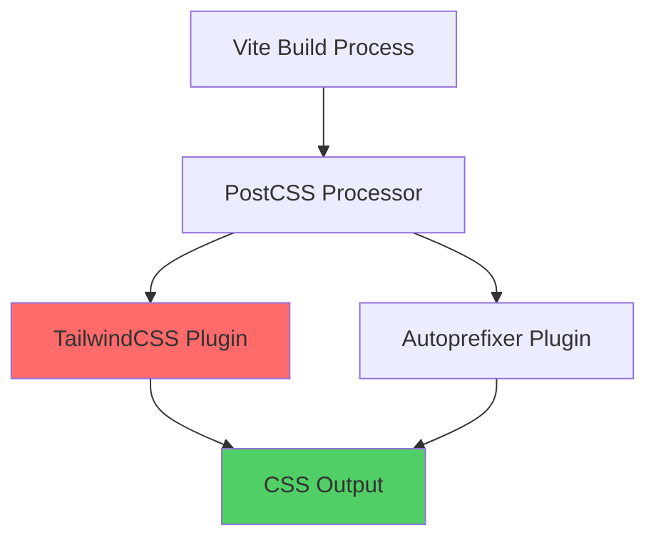
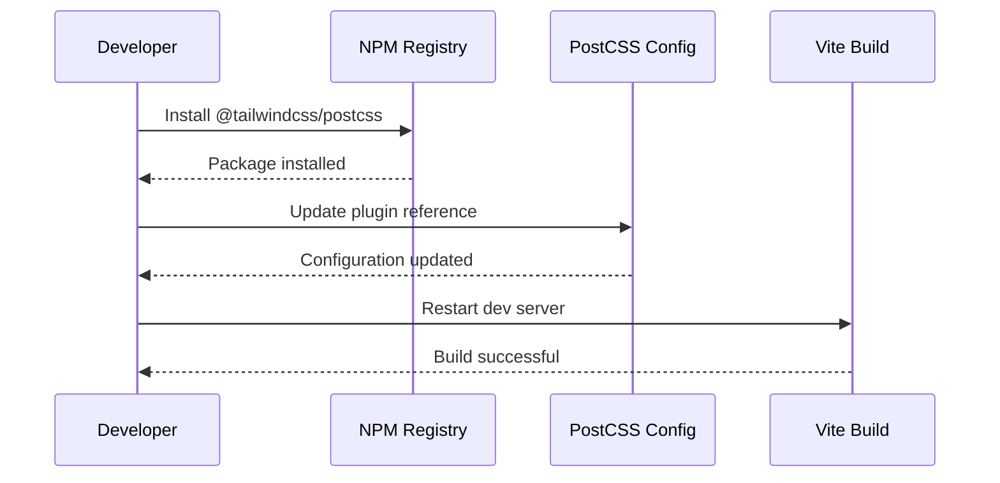

# TailwindCSS PostCSS Migration Design

## Overview

This design document outlines the migration strategy to resolve the PostCSS plugin error in the Portfolio React application. The error occurs because TailwindCSS v4.0+ requires using the separate `@tailwindcss/postcss` plugin instead of the old direct plugin approach.

**Error Context:**
```
[plugin:vite:css] [postcss] It looks like you're trying to use `tailwindcss` directly as a PostCSS plugin. The PostCSS plugin has moved to a separate package, so to continue using Tailwind CSS with PostCSS you'll need to install `@tailwindcss/postcss` and update your PostCSS configuration.
```

## Technology Stack Analysis

**Current Configuration:**
- **Build Tool**: Vite 7.1.2
- **CSS Framework**: TailwindCSS 3.4.15
- **PostCSS**: 8.5.6
- **Autoprefixer**: 10.4.21
- **React**: 19.1.1

**Project Structure:**
```
portfolio-react/
├── postcss.config.js    # Current PostCSS configuration
├── tailwind.config.js   # TailwindCSS configuration
├── package.json         # Dependencies
└── src/
    └── index.css        # Main CSS entry point
```

## Migration Architecture

### Current State Analysis



**Current PostCSS Configuration:**
```javascript
export default {
  plugins: {
    tailwindcss: {},     // ❌ Deprecated approach
    autoprefixer: {},
  },
}
```

### Target Architecture

```mermaid
graph TD
    A[Vite Build Process] --> B[PostCSS Processor]
    B --> C[@tailwindcss/postcss Plugin]
    B --> D[Autoprefixer Plugin]
    C --> E[CSS Output]
    D --> E
    
    style C fill:#51cf66
    style E fill:#51cf66
```

**Target PostCSS Configuration:**
```javascript
export default {
  plugins: {
    '@tailwindcss/postcss': {},  // ✅ New approach
    autoprefixer: {},
  },
}
```

## Migration Strategy

### Phase 1: Package Installation

**Dependencies Update:**
```json
{
  "devDependencies": {
    "@tailwindcss/postcss": "^4.0.0",
    "tailwindcss": "^3.4.15",
    "postcss": "^8.5.6",
    "autoprefixer": "^10.4.21"
  }
}
```

**Installation Commands:**
```bash
npm install --save-dev @tailwindcss/postcss
```

### Phase 2: Configuration Migration

**PostCSS Configuration Update:**

| Component | Before | After |
|-----------|--------|-------|
| Plugin Reference | `tailwindcss: {}` | `'@tailwindcss/postcss': {}` |
| Import Method | Direct plugin | Separate package |
| Configuration Options | Same object structure | Enhanced options available |

**Migration Steps:**


### Phase 3: Compatibility Verification

**TailwindCSS Configuration Compatibility:**
The existing `tailwind.config.js` remains fully compatible:

```javascript
export default {
  content: ["./index.html", "./src/**/*.{js,ts,jsx,tsx}"],
  theme: {
    extend: {
      colors: { /* Custom color palette */ },
      fontFamily: { /* Custom fonts */ },
      animation: { /* Custom animations */ }
    },
  },
  plugins: [
    require('@tailwindcss/typography'),
    require('@tailwindcss/forms'),
  ],
}
```

**CSS Entry Point Verification:**
The `src/index.css` file structure remains unchanged:
```css
@tailwind base;
@tailwind components;
@tailwind utilities;
```

## Implementation Details

### Configuration Changes

**File: `postcss.config.js`**
```javascript
// Before (causing error)
export default {
  plugins: {
    tailwindcss: {},
    autoprefixer: {},
  },
}

// After (migration)
export default {
  plugins: {
    '@tailwindcss/postcss': {},
    autoprefixer: {},
  },
}
```

### Build Process Integration

```mermaid
flowchart LR
    A[src/index.css] --> B[Vite CSS Pipeline]
    B --> C[PostCSS Processing]
    C --> D[@tailwindcss/postcss]
    C --> E[Autoprefixer]
    D --> F[Processed CSS]
    E --> F
    F --> G[Browser Output]
    
    style D fill:#06b6d4
    style F fill:#10b981
```

**Process Flow:**
1. **CSS Import**: Vite processes `src/index.css`
2. **PostCSS Pipeline**: Applies configured plugins
3. **TailwindCSS Processing**: New plugin processes utilities
4. **Autoprefixer**: Adds vendor prefixes
5. **Output Generation**: Final CSS for browser

### Error Resolution

**Root Cause:**
- TailwindCSS v4.0+ separated PostCSS plugin into dedicated package
- Vite's CSS pipeline expects new plugin structure
- Legacy configuration triggers compatibility error

**Resolution Strategy:**
- Install new plugin package
- Update configuration reference
- Maintain existing TailwindCSS features
- Zero impact on component styling

## Testing Strategy

### Verification Checklist

| Test Category | Verification Points |
|---------------|-------------------|
| **Build Process** | ✓ Vite dev server starts without errors |
| **CSS Generation** | ✓ TailwindCSS utilities compile correctly |
| **Component Styling** | ✓ All existing styles render properly |
| **Theme System** | ✓ Custom colors and fonts work |
| **Responsive Design** | ✓ Breakpoints function correctly |
| **Plugin Compatibility** | ✓ Typography and Forms plugins work |

### Test Commands

```bash
# Development server test
npm run dev

# Production build test
npm run build

# Linting verification
npm run lint

# Component testing
npm run test
```

### Component Impact Assessment

**Zero-Impact Migration:**
- All existing component styles preserved
- Custom theme colors maintain functionality
- Animation classes continue working
- Typography plugin integration unchanged
- Forms plugin styling preserved

## Risk Assessment

### Migration Risks

| Risk Level | Scenario | Mitigation |
|------------|----------|------------|
| **Low** | Configuration syntax error | Validate PostCSS config structure |
| **Low** | Package installation failure | Use exact version specification |
| **Minimal** | Build cache issues | Clear node_modules and reinstall |
| **Minimal** | Style regression | Compare before/after CSS output |

### Rollback Strategy

**Quick Rollback Steps:**
1. Revert `postcss.config.js` to original state
2. Uninstall `@tailwindcss/postcss` package
3. Restart development server
4. Verify original functionality

## Performance Considerations

### Build Performance

**Expected Improvements:**
- Faster CSS processing with optimized plugin
- Better tree-shaking of unused utilities
- Enhanced development mode hot reloading

**Metrics to Monitor:**
- Build time comparison (before/after)
- CSS bundle size optimization
- Development server startup time

### Browser Performance

**No Impact Expected:**
- Generated CSS structure remains identical
- Browser compatibility unchanged
- Runtime performance unaffected

## Deployment Considerations

### Environment Compatibility

**Development Environment:**
- Node.js compatibility maintained
- Vite version requirements satisfied
- NPM/Yarn package resolution

**Production Build:**
- CSS optimization preserved
- Minification process unchanged
- CDN deployment compatibility

### Continuous Integration

**CI/CD Pipeline Updates:**
```bash
# Ensure CI installs new dependency
npm ci

# Verify build process
npm run build

# Test application functionality
npm run test
```

## Future Considerations

### TailwindCSS v4.0 Migration Path

**Potential Future Updates:**
- Monitor TailwindCSS v4.0 stable release
- Evaluate new CSS-first architecture
- Consider configuration simplification options

**Preparation Steps:**
- Document current custom theme usage
- Inventory component dependencies
- Plan for potential breaking changes

### Plugin Ecosystem

**Current Plugin Compatibility:**
- `@tailwindcss/typography` - Fully compatible
- `@tailwindcss/forms` - Fully compatible
- Custom plugins - Review for v4.0 compatibility

## Conclusion

This migration resolves the immediate PostCSS error with minimal configuration changes and zero impact on existing functionality. The new `@tailwindcss/postcss` plugin provides better integration with modern build tools while maintaining full backward compatibility with existing TailwindCSS features and custom configurations.