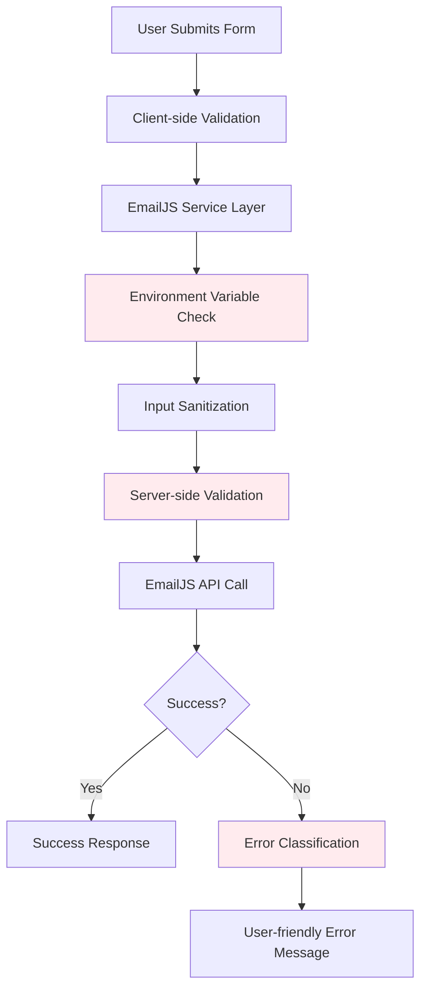
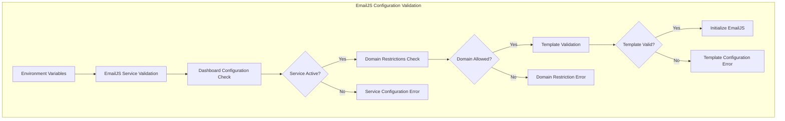
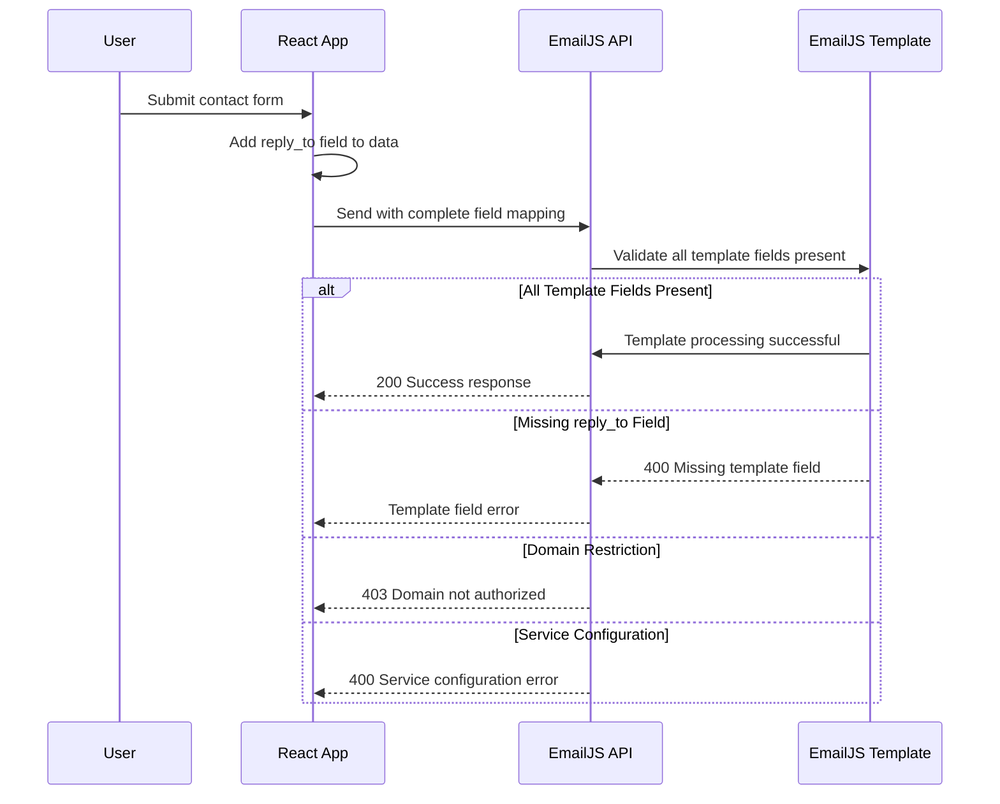

# Cross-Device Email Service Reliability Design

## Overview

This design addresses the critical issue where contact form submissions work successfully from the developer's machine but fail on other devices with "please check your input and try again" errors. The problem indicates cross-device compatibility issues in the EmailJS service integration that need systematic analysis and resolution.

## Problem Analysis

### Current Issue Manifestation
- **Local Development**: Email submissions work correctly on any device
- **Production Server**: Email submissions fail with "please check your input and try again" error
- **Same Device Different Environment**: Confirms issue is environment-specific, not device-specific
- **Error Pattern**: Generic validation error suggests EmailJS configuration is missing in production

### Root Cause Confirmation

### Root Cause Confirmation

**Updated Analysis Based on EmailJS Template Configuration:**

The user has provided their EmailJS template screenshot which shows:
- Template ID: `template_knt001v` (matches environment variable)
- Subject: "New message from {{from_name}}"
- Template fields properly configured:
  - `{{name}}` for sender name
  - `{{email}}` for sender email  
  - `{{project}}` for project field
  - `{{message}}` for message content
- Service has 189 requests remaining (quota not exceeded)
- Template appears active and properly configured

**Revised Root Cause Analysis:**

1. **Template Field Mapping Mismatch**: Form data structure may not match template expectations
2. **Domain Restrictions**: EmailJS service may have domain whitelist restrictions for production
3. **Service Configuration Issues**: Service settings may restrict production domain usage
4. **CORS or Authentication Issues**: Production domain may face different authentication requirements
5. **Error Response Masking**: Actual EmailJS errors being converted to generic validation errors

## Architecture Analysis

### Current Email Service Flow



### Vulnerability Points

1. **Data Structure Mapping Issues**
   - Form data field names may not match EmailJS template expectations
   - Template expects `{{from_name}}` but form may be sending different field structure
   - Additional template variables like `{{reply_to}}` may be required but missing

2. **Domain and Service Restrictions**
   - EmailJS service may have domain whitelist restrictions for production usage
   - Production domain may not be authorized in EmailJS service settings
   - Service configuration may restrict usage to localhost/development domains only

3. **Error Response Translation Issues**
   - EmailJS API errors being incorrectly classified as validation errors
   - Actual service response errors hidden behind generic error messaging
   - Network or authentication errors masked as input validation failures

## Technology Stack Analysis

### Frontend Components
- **React 18** with React Hook Form for form management
- **Vite** as build tool with environment variable handling
- **TailwindCSS** for styling
- **EmailJS Browser SDK** for email service integration

### Service Layer
- **emailService.js**: Centralized email handling with validation
- **Environment Variables**: Vite-prefixed configuration
- **Error Classification**: Comprehensive error type mapping

## Enhanced Email Service Design

### 1. EmailJS Service and Domain Configuration Audit



**Critical Investigation Points:**

1. **Template Data Mapping Verification**
   - Confirm form data structure matches template field expectations
   - Template shows `{{from_name}}` in subject but form sends `name` field
   - Verify template variables align with emailService data structure
   - Check if additional fields like `to_name`, `reply_to` are properly mapped

2. **Service Domain Configuration**
   - Check EmailJS service settings for domain restrictions
   - Verify production domain is whitelisted in service configuration
   - Confirm service allows usage from production domain (not just localhost)
   - Review service plan limitations for production usage

3. **Template and Service Status**
   - Template appears active with 189 requests remaining
   - Service `service_fxrmbq9` needs domain authorization verification
   - Template `template_knt001v` field mappings need cross-reference with form data
   - Public key `505hKYguhDbLkUNQi` permissions for production domain

### 2. Data Structure Analysis and Template Mapping Fix

**Current EmailJS Data Structure (from emailService.js):**

```javascript
const emailData = {
  name: sanitizedData.name,           // Maps to {{name}}
  email: sanitizedData.email,         // Maps to {{email}}
  project: sanitizedData.project,     // Maps to {{project}}
  message: sanitizedData.message,     // Maps to {{message}}
  from_name: sanitizedData.name,      // Maps to {{from_name}} in subject
  from_email: sanitizedData.email,    // Available for template use
  to_name: 'Sadique Hasan',          // Static recipient name
  timestamp: new Date().toISOString() // Additional metadata
};
```

**Template Analysis from Screenshot:**
- Subject: "New message from {{from_name}}" ✓ (Correctly mapped)
- Template fields: {{name}}, {{email}}, {{project}}, {{message}} ✓ (All correctly mapped)
- Reply To: Shows `{{reply_to}}` but code doesn't send this field ❌ (Potential issue)

**Potential Data Mapping Issue:**
The template "Reply To" field shows `{{reply_to}}` but the emailService doesn't send a `reply_to` field. This could cause EmailJS to reject the request.

**Enhanced Data Structure:**

```javascript
const emailData = {
  name: sanitizedData.name,
  email: sanitizedData.email,
  project: sanitizedData.project,
  message: sanitizedData.message,
  from_name: sanitizedData.name,
  from_email: sanitizedData.email,
  reply_to: sanitizedData.email,      // Add missing reply_to field
  to_name: 'Sadique Hasan',
  timestamp: new Date().toISOString()
};
```

**Implementation Strategy:**
- Add missing `reply_to` field to match template expectations
- Implement comprehensive error logging to capture actual EmailJS API responses
- Add template field validation to ensure all required fields are present
- Create development mode debugging for template field mapping verification

### 3. Enhanced Error Handling and Domain Configuration



**Immediate Implementation Steps:**

1. **Fix Template Field Mapping**
   - Add `reply_to: sanitizedData.email` to emailData object
   - Ensure all template variables have corresponding data fields
   - Test template field completeness in development

2. **Enhanced Error Response Logging**
   - Capture actual EmailJS HTTP status codes and response messages
   - Log detailed error information for production debugging
   - Implement error classification based on specific EmailJS responses

3. **Domain Configuration Verification**
   - Check EmailJS service settings for domain restrictions
   - Verify production domain is authorized in service configuration
   - Test service accessibility from production domain

## Implementation Roadmap

### Phase 1: Immediate Template Field Mapping Fix
1. **Add Missing Template Fields**
   - Update `emailService.js` to include `reply_to` field in emailData object
   - Ensure all template variables from screenshot have corresponding data fields
   - Test template field mapping completeness in development environment
   - Deploy updated field mapping to production

2. **Enhanced Error Response Capture**
   - Implement detailed EmailJS API error response logging
   - Add HTTP status code and response body capture for debugging
   - Create temporary debug mode for production error analysis
   - Log actual EmailJS error messages instead of generic validation errors

3. **Domain Configuration Verification**
   - Access EmailJS service settings to check domain restrictions
   - Verify production domain is whitelisted in service configuration
   - Test EmailJS service accessibility from production domain
   - Confirm service plan allows production domain usage

### Phase 2: Service Configuration and Error Analysis
1. **EmailJS Service Domain Configuration**
   - Review service settings for domain restrictions and whitelist configuration
   - Add production domain to authorized domains if restricted
   - Verify service plan supports production domain usage
   - Test service configuration with updated field mappings

2. **Error Classification Implementation**
   - Implement specific error handling for EmailJS HTTP status codes (400, 403, 422, 500)
   - Add user-friendly error messages based on actual EmailJS error responses
   - Create fallback messaging system for service configuration issues
   - Distinguish between template field errors and service configuration errors

## Testing Strategy

### Template Field Mapping Testing

| Template Field | Current Data Mapping | Status | Action Required |
|---------------|---------------------|---------|----------------|
| `{{name}}` | `name: sanitizedData.name` | ✅ Correct | None |
| `{{email}}` | `email: sanitizedData.email` | ✅ Correct | None |
| `{{project}}` | `project: sanitizedData.project` | ✅ Correct | None |
| `{{message}}` | `message: sanitizedData.message` | ✅ Correct | None |
| `{{from_name}}` | `from_name: sanitizedData.name` | ✅ Correct | None |
| `{{reply_to}}` | Missing from emailData | ❌ Missing | Add `reply_to: sanitizedData.email` |

### Production Debugging Steps

1. **Immediate Template Field Fix**
   - Add missing `reply_to` field to emailData object in `emailService.js`
   - Deploy updated field mapping to production
   - Test contact form submission after field mapping fix

2. **Error Response Analysis**
   - Open browser developer tools during production form submission
   - Check Network tab for EmailJS API request details
   - Look for HTTP status codes: 400 (template field error), 403 (domain restriction), 422 (validation error)
   - Examine response body for specific EmailJS error messages

3. **Service Configuration Verification**
   - Access EmailJS dashboard service settings
   - Check "Domains" or "Security" section for domain restrictions
   - Verify production domain is in allowed domains list
   - Confirm service is active and not suspended

## Monitoring and Maintenance

### Success Metrics
- **EmailJS Service Health**: Successful service initialization and API connectivity
- **Error Classification Accuracy**: Proper identification of service vs validation vs domain errors
- **Production Service Reliability**: Consistent email delivery from production environment
- **User Experience**: Clear, actionable error messages when service issues occur

### Immediate Action Items

1. **Fix Missing Template Field** (Priority: Critical)
   - Update `emailService.js` to add `reply_to: sanitizedData.email` in emailData object
   - This is the most likely cause of the "please check your input" error
   - The template expects `{{reply_to}}` but the current code doesn't provide this field
   - Deploy the field mapping fix immediately

2. **Enhanced Error Response Logging** (Priority: High)
   - Temporarily enable detailed EmailJS error response logging in production
   - Capture actual HTTP status codes and response messages from EmailJS API
   - Replace generic validation error messages with specific EmailJS error details
   - This will help identify if the field mapping fix resolves the issue

3. **Service Domain Configuration Check** (Priority: Medium)
   - Access EmailJS service settings to verify domain restrictions
   - Ensure production domain is whitelisted for service usage
   - Check if service plan has any production domain limitations
   - Verify service remains active with sufficient quota

### Root Cause Analysis Summary

Based on the EmailJS template screenshot and emailService.js analysis:

**Most Likely Cause: Missing Template Field**
- Template expects `{{reply_to}}` field in Reply To section
- Current emailService.js doesn't include `reply_to` in the data sent to EmailJS
- EmailJS returns validation error when template fields are missing
- This explains why it works locally (same template/code) but fails consistently in production

**Secondary Possibilities:**
- Domain restrictions in EmailJS service settings preventing production usage
- Service configuration issues specific to production domain access
- Template configuration requiring additional fields not currently provided

The field mapping fix should resolve the issue immediately, with enhanced error logging providing confirmation and future debugging capability.